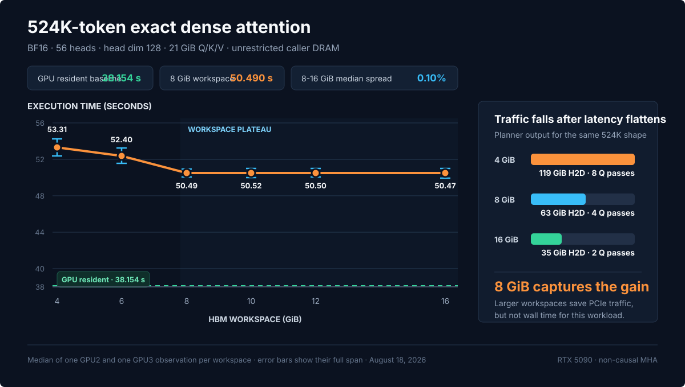
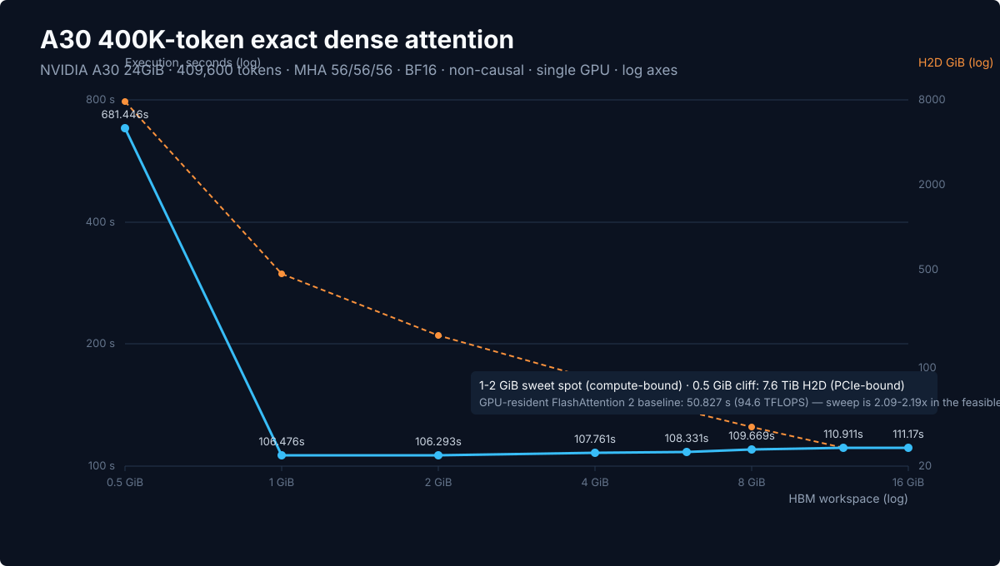

# seqattn

`seqattn` is an inference-only paged attention runtime for sequences larger
than a fixed GPU or host-memory working set. Q/K/V may live in caller-owned CPU
DRAM or in an aligned NVMe store. Query super-blocks stay resident in HBM while
K/V pages move through a bounded DRAM cache, pinned staging ring, and GPU ring.
The runtime never materializes the score matrix or requires complete paged
Q/K/V/output tensors in host memory.

The project follows the same IO-aware principle that makes FlashAttention
effective inside the GPU memory hierarchy, but applies it one level higher:

```text
FlashAttention:   HBM backing -> SRAM/register working set
seqattn tensor:   CPU DRAM backing -> HBM working set
seqattn paged:    NVMe backing -> DRAM cache -> pinned staging -> HBM working set
```

This is not a replacement for FlashAttention when full Q/K/V fit in VRAM.
It targets exact long-context inference under a fixed GPU-memory budget and
reports the resulting PCIe and latency cost explicitly.

## Current performance

### RTX 5090: 524K-token DRAM streaming

The current Blackwell path was measured on one physical RTX 5090 with a single
benchmark process and no concurrent SeqAttn scan. The problem is exact,
non-causal BF16 MHA with 524,288 tokens, 56 Q/K/V heads, and head dimension 128.
Q, K, and V are 7GiB each; output is another 7GiB. Complete Q/K/V remains in
caller-owned pinned DRAM while only a planned working set resides in HBM.

<p align="center">
  
</p>

| HBM workspace | PID GPU peak | Resident Q | Q passes | H2D | Execution | Effective TFLOPS |
|---:|---:|---:|---:|---:|---:|---:|
| 1 GiB | 1.541 GiB | 9,856 | 54 | 763 GiB | 38.201 s | 206.3 |
| **2 GiB** | **2.533 GiB** | **28,416** | **19** | **273 GiB** | **36.247 s** | **217.4** |
| 4 GiB | 4.520 GiB | 65,536 | 8 | 119 GiB | 36.073 s | 218.5 |
| 6 GiB | 6.520 GiB | 102,656 | 6 | 91 GiB | 36.122 s | 218.2 |
| 8 GiB | 8.525 GiB | 139,904 | 4 | 63 GiB | 36.113 s | 218.2 |
| 10 GiB | 10.525 GiB | 177,024 | 3 | 49 GiB | 36.111 s | 218.3 |
| 12 GiB | 12.520 GiB | 214,144 | 3 | 49 GiB | 36.053 s | 218.6 |
| 14 GiB | 14.525 GiB | 251,392 | 3 | 49 GiB | 36.010 s | 218.9 |

The automatic Blackwell launch profile resolves to `128x64`, 8 warps, and 3
stages at every point. Moving from 1GiB to 2GiB cuts execution time by 5.1%.
The complete 2-14GiB range stays within 0.66% of the fastest observation, while
larger workspaces continue to reduce Q passes and logical H2D traffic. All
eight sampled output signatures are identical. Data preparation is excluded
from execution time and took 25.837 seconds with 32 CPU workers.

See the [current RTX 5090 workspace report](docs/rtx5090_dram_workspace_sweep_2026-08-19.md)
for the complete protocol, memory accounting, and measurement limits.

### A30: 400K-token DRAM streaming

The current Ampere path was measured on one physical NVIDIA A30 with a single
benchmark process and no concurrent SeqAttn scan. The problem is exact,
non-causal BF16 MHA with 409,600 tokens, 56 Q/K/V heads, and head dimension 128.
Q, K, and V are 5.469GiB each; output is another 5.469GiB. Complete Q/K/V
remains in caller-owned pinned DRAM while only a planned working set resides
in HBM.

<p align="center">
  
</p>

| HBM workspace | PID GPU peak | Resident Q | Q passes | H2D | Execution | Effective TFLOPS |
|---:|---:|---:|---:|---:|---:|---:|
| 0.5 GiB | 0.717 GiB | 576 | 712 | 7,793 GiB | 681.162 s | 7.06 |
| **1 GiB** | **1.229 GiB** | **9,856** | **42** | **465 GiB** | **102.319 s** | **47.01** |
| 2 GiB | 2.221 GiB | 28,416 | 15 | 170 GiB | 105.233 s | 45.71 |
| 4 GiB | 4.217 GiB | 65,600 | 7 | 82 GiB | 106.956 s | 44.98 |
| 6 GiB | 6.213 GiB | 102,720 | 4 | 49 GiB | 108.102 s | 44.50 |
| 8 GiB | 8.213 GiB | 139,904 | 3 | 38 GiB | 108.696 s | 44.26 |
| 12 GiB | 12.213 GiB | 214,208 | 2 | 27 GiB | 109.078 s | 44.10 |
| 16 GiB | 16.213 GiB | 288,512 | 2 | 27 GiB | 108.820 s | 44.20 |

The fixed Ampere launch profile is `64x64`, 4 warps, and 1 stage at every
point. The 1GiB observation is fastest and improves by 3.90% over the previous
2-stage kernel. The complete 1-16GiB range stays within 6.61% of the fastest
observation, while larger workspaces reduce Q passes and logical H2D traffic.
At 0.5GiB, 712 Q passes generate 7.61TiB of logical H2D traffic and make the
operator PCIe-bound. All eight sampled output signatures are identical. Data
preparation is excluded from execution time and took 24.757 seconds with 32
CPU workers.

The same shape was also measured with GPU-resident FlashAttention 2
(`flash-attn 2.7.4.post1`) in an independent process:

| Backend | Q/K/V residency | Torch GPU peak | Execution | Effective TFLOPS | Relative latency |
|---|---|---:|---:|---:|---:|
| FlashAttention 2 | GPU HBM | 21.961 GiB | 50.827 s | 94.6 | 1.000x |
| **seqattn, 1GiB workspace** | **Pinned CPU DRAM** | **0.968 GiB** | **102.319 s** | **47.01** | **2.013x** |

FlashAttention 2 is the latency baseline when the complete 21.875GiB
Q/K/V/output working set fits in HBM. The 1GiB seqattn point reduces the torch
allocator peak by 95.6% by keeping Q/K/V in host DRAM, at the cost of 2.013x
execution time. FlashAttention 2 leaves output in HBM, while the seqattn timing
includes the final 5.469GiB D2H output transfer. Neither execution time includes
input preparation or the FlashAttention 2 HBM-residency preparation. The
FlashAttention 2 observation is retained from 2026-08-18; the optimized-kernel
container did not include FlashAttention 2.

See the [current A30 workspace report](docs/a30_dram_workspace_sweep_2026-08-19.md)
for the complete protocol, baseline comparison, memory accounting, and
measurement limits.

## Features

- CPU-backed contiguous and pinned Q/K/V.
- Dense and packed variable-length APIs.
- BF16 and FP16 Triton kernels; auditable FP32 PyTorch reference.
- Non-causal and bottom-right-aligned causal attention.
- MHA, GQA, and MQA (`q_heads % kv_heads == 0`).
- Budget-aware query super-block planning.
- Fused QK, masking, online softmax, PV, and cross-tile state update.
- H2D, compute, and D2H streams with K/V ring buffers and optional double-buffered output.
- Persistent runner/workspace to avoid allocator growth across repeated calls.
- A fixed-budget paged API with memory, callback, and NVMe sources/sinks.
- Linux `O_DIRECT` files with aligned page records and explicit failure instead
  of silent buffered-I/O fallback.
- A deterministic two-region K/V cache: 80% low-page-id hot set and 20% rolling
  read-ahead by default.
- Optional INT8 K/V storage with FP16 scales per 64 tokens/head. This mode is
  approximate and must be selected explicitly.
- JSON benchmark output, NVML process peaks, logical PCIe traffic, and NVTX ranges.

V1 is inference-only: backward and dropout are intentionally unsupported.

## Relationship to Stream-CQSA

[Stream-CQSA](https://github.com/yiming-b/Stream-CQSA) and `seqattn` solve the
same capacity problem with different task decompositions.  Both keep complete
Q/K/V outside HBM and compute exact dense attention with a bounded GPU working
set.  Stream-CQSA recursively constructs combinatorial self-attention
subsequences; `seqattn` uses regular two-dimensional query-super-block by
key/value-tile scheduling.

For the default Stream-CQSA construction, recursion depth `t` produces `7^t`
subsequences of approximate length `N * (3/7)^t`.  In its current CPU-backed,
path-by-path gather implementation, the aggregate Q/K/V token occurrence is
therefore approximately:

```text
7^t * N * (3/7)^t = 3^t * N
```

The local FlashAttention calls also cover an aggregate dense score area of:

```text
7^t * (N * (3/7)^t)^2 = (9/7)^t * N^2
```

Interactions excluded by the CQS group mask are mathematically removed, but
the current modified FlashAttention path applies that mask after the local QK
matrix multiplication.  Consequently, recursive decomposition can increase
both host/device traffic and launched dense tensor-core work.

If `seqattn` divides Q into `r` resident super-blocks, its logical traffic is:

```text
H2D = |Q| + r * (|K| + |V|)
D2H = |O|
```

Every Q token is transferred once.  Each K/V tile is reused by all query rows
in the current resident super-block, and only the final FP16/BF16 output is
returned to the host.  With enough workspace for all Q rows (`r = 1`), Q, K,
and V are each transferred once.

Another important difference is reduction placement.  The current CPU-backed
Stream-CQSA path reconstructs per-subsequence FP32 numerator/denominator values
from FlashAttention output and LSE, transfers them to the CPU, and scatter-adds
them into full-sequence FP32 accumulators.  `seqattn` instead keeps FP32
online-softmax `(max, normalizer, accumulator)` state in HBM only for the
resident Q super-block.  It never reconstructs an absolute `exp(LSE)` global
denominator and does not require a full FP32 CPU numerator tensor.

This gives `seqattn` several advantages for regular dense inference:

- deterministic Q reuse across all K/V tiles in a super-block;
- lower logical H2D and substantially lower D2H volume at deep decomposition;
- no combinatorial task-count or masked-MMA amplification;
- stable FlashAttention-style online-softmax merging on the GPU;
- no full-sequence FP32 numerator accumulator in host RAM;
- an existing H2D/compute/D2H pipeline with reusable K/V ring buffers;
- native packed varlen, causal, cross-attention, GQA, and MQA interfaces.

The scope is deliberately narrower.  Stream-CQSA includes research forward and
backward paths and arbitrary CQS group masks.  `seqattn` V1 targets dense exact
inference only; it does not currently implement backward, dropout, arbitrary
sparse masks, a dynamic GPU page table, cache replacement, or cross-call page
residency.  Its HBM usage is best described as a statically scheduled resident
working set, not a general-purpose paging cache.

The comparison above is an implementation and I/O-complexity comparison, not a
claim based on a same-machine Stream-CQSA benchmark.  Direct comparisons should
use identical shapes, dtype, GPU-memory limits, CPU NUMA placement, and measured
H2D/D2H traffic.

## Installation

```bash
pip install -e '.[cuda,benchmark,dev]'
```

Linux, CUDA, PyTorch 2.5+, and Triton 3.1+ are the initial supported platform.

## API

The functional API mirrors the important parts of FlashAttention's dense and
varlen call shapes, but inputs and outputs are CPU tensors:

```python
import torch
from seqattn import StreamingAttentionConfig, streaming_attn_varlen_func

q = torch.randn(61_312, 56, 128, dtype=torch.bfloat16, pin_memory=True)
k = torch.randn(61_312, 56, 128, dtype=torch.bfloat16, pin_memory=True)
v = torch.randn(61_312, 56, 128, dtype=torch.bfloat16, pin_memory=True)
cu = torch.tensor([0, 61_312], dtype=torch.int32)

out = streaming_attn_varlen_func(
    q,
    k,
    v,
    cu,
    cu,
    max_seqlen_q=61_312,
    max_seqlen_k=61_312,
    causal=False,
    config=StreamingAttentionConfig(
        workspace_budget_bytes=4 * 2**30,
        kv_chunk_tokens=4096,
        backend="triton",
    ),
)
```

For repeated transformer layers or denoise steps, build one plan and reuse one
runner.  This keeps buffers, streams, and CUDA events persistent:

```python
from seqattn import StreamingAttentionRunner, build_plan

config = StreamingAttentionConfig(
    workspace_budget_bytes=4 * 2**30,
    kv_chunk_tokens=4096,
)
plan = build_plan(
    q_heads=56,
    kv_heads=56,
    head_dim=128,
    dtype=torch.bfloat16,
    device="cuda",
    max_q_tokens=61_312,
    max_kv_tokens=61_312,
    config=config,
)
runner = StreamingAttentionRunner(plan, config)
out = torch.empty_like(q).pin_memory()
runner(q, k, v, cu, cu, out=out)
```

Pass a reusable pinned `out` buffer in latency-sensitive loops.  Omitting it is
convenient, but allocating hundreds of MiB of pinned host memory can dominate a
short attention call and introduce allocator jitter.

### Projection-attention-output pipeline

`ProjectedAttentionRunner` connects a chunked GPU QKV producer to the Triton
attention runtime and consumes each finalized attention tile with an output
projection before D2H:

```python
from seqattn import (
    ProjectedAttentionRunner,
    ProjectionPipelineConfig,
    StreamingAttentionConfig,
    build_plan,
)

attention_config = StreamingAttentionConfig(
    backend="triton",
    workspace_budget_bytes=2 * 2**30,
    kv_chunk_tokens=4096,
    num_output_buffers=2,
)
pipeline_config = ProjectionPipelineConfig(
    projection_chunk_tokens=2048,
    num_projection_buffers=2,
)
plan = build_plan(
    q_heads=56,
    kv_heads=56,
    head_dim=128,
    dtype=hidden_cpu.dtype,
    device="cuda",
    max_q_tokens=hidden_cpu.shape[0],
    max_kv_tokens=hidden_cpu.shape[0],
    config=attention_config,
)
runner = ProjectedAttentionRunner(plan, attention_config, pipeline_config)

def project_qkv(hidden_gpu, start, stop):
    qkv = qkv_proj(hidden_gpu).view(-1, 56, 3, 128)
    # Model-specific Q/K normalization and RoPE can be applied here.
    return (
        qkv[:, :, 0, :].contiguous(),
        qkv[:, :, 1, :].contiguous(),
        qkv[:, :, 2, :].contiguous(),
    )

def output_projector(attention_gpu, start, stop):
    # This callback may also perform an inference-only gate/residual epilogue.
    return out_proj(attention_gpu)

projected_cpu = runner(
    hidden_cpu,
    cu_seqlens,
    project_qkv=project_qkv,
    output_projector=output_projector,
    output_features=hidden_size,
)
```

Exact global self-attention still has one unavoidable barrier: every K/V token
in a packed segment must be projected before a query result can be finalized.
The projection phase pipelines hidden H2D, QKV compute, and Q/K/V D2H across
chunks.  After the barrier, attention output stays on GPU and flows directly
into output projection, avoiding a raw-attention D2H-to-H2D round trip.

The projection callbacks are intentionally model-owned.  They can wrap normal
BF16/FP16 linear layers, quantized/offloaded modules, Q/K normalization, rotary
embedding, and output gate/residual logic while the attention core remains a
Triton operator.

`workspace_budget_bytes` only covers buffers owned by `seqattn`.  Whole-process
budgets must also reserve memory for the CUDA context, weights, and caller-owned
activations.

`output_mode="device_consumer"` additionally finalizes attention in the Q HBM
buffer and removes the separate raw-output HBM allocation. This opt-in mode is
useful when a fixed Q chunk makes the smaller allocation footprint more
important than maximizing throughput. With automatic planning, retaining a
separate output buffer can allow a more favorable resident-Q layout.

### Fixed-host-memory paged API

The paged API does not require complete CPU Q/K/V tensors. `PageSource` reads
one caller-selected page into a preallocated staging buffer, while `PageSink`
consumes an output page immediately:

```python
from seqattn import (
    NvmeOutputSink,
    NvmeQKVStore,
    PagedAttentionConfig,
    PagedAttentionRunner,
    StreamingAttentionConfig,
)

store = NvmeQKVStore("/local-nvme/request-17", direct_io=True)
config = PagedAttentionConfig(
    host_memory_budget_bytes=8 * 2**30,
    direct_io=True,
    kv_storage_dtype="bf16",
    attention=StreamingAttentionConfig(
        workspace_budget_bytes=2 * 2**30,
        backend="triton",
    ),
)
runner = PagedAttentionRunner(config, device="cuda")
runner.run(
    store,
    store,
    cu_seqlens_q,
    cu_seqlens_k,
    NvmeOutputSink("/local-nvme/request-17-output", direct_io=True),
)
```

`MemoryPageSource` and `MemoryPageSink` adapt caller-owned CPU tensors to the
same interface. Complete tensors owned by the caller are not charged to the
operator budget, so the tensor API and a complete `MemoryPageSink` output
are compatibility modes, not low-RAM execution.

The default 8GiB host policy reserves at most 1GiB for pinned staging, 512MiB
for direct-I/O bounce buffers, and 128MiB for fixed metadata. The remainder is
the DRAM K/V cache. Every runtime allocation is registered with
`HostMemoryPlan`; category or total-budget overruns fail before execution.
Q pages bypass the long-lived cache, and output pages are handed to their sink
as soon as D2H completes.

### NVMe store construction

`NvmeQKVWriter.from_tensors(...)` is a convenience path. Large requests should
use `NvmeQKVWriter.write_pages(q_pages, kv_pages)`, whose iterators yield one
already-sized page at a time. The on-disk layout is:

```text
manifest.json
q.bin
kv.bin
```

K and V for one token page share a single aligned record and one read. Payload
offsets, record lengths, and bounce buffers are 4096-byte aligned. Data files
are written under temporary names, checked and fsynced, then the manifest is
published last. With `direct_io=True`, unsupported filesystems fail explicitly;
`direct_io=False` exists for tests and is never an implicit fallback.

`NvmeOutputSink` publishes an analogous `manifest.json` plus `out.bin` without
allocating a full CPU output tensor. `CallbackOutputSink` supports immediate
application-owned consumption. Persistent stores are caller-managed;
`ephemeral_nvme_directory()` provides explicit temporary lifecycle management.

### Exact and INT8 modes

`kv_storage_dtype="bf16"` is the default exact mode. FP16 exact stores use
`"fp16"`. `"int8"` is optional and approximate: Q remains BF16/FP16, K/V use
symmetric INT8 quantization, and FP16 scales are stored per 64 tokens and KV
head. The Triton load path applies scales before QK/PV without creating a full
BF16 K/V tile. Preparation time and numerical error must be reported separately
from exact results.

### Paged benchmark

Run one point with `seqattn-paged-bench`, or the complete matrix with
`benchmarks/paged_sweep.py`. Results include end-to-end wall time, I/O and
queue-wait time, cache statistics, logical/physical NVMe bytes, H2D/D2H bytes,
Torch/NVML GPU memory, process RSS, and operator host-memory peaks.

Physical NVMe performance claims require a measured local device and
`--formal-local-nvme`. Without that flag, result JSON is marked as
functional/memory-only so correctness and memory-limit tests cannot be
mistaken for storage measurements.

For pipeline testing without a physical NVMe device, `simulated-nvme` keeps
Q/K/V in caller-owned memory and applies per-page latency plus an aggregate
read/write bandwidth limit inside the normal I/O worker pipeline:

```bash
seqattn-paged-bench \
  --storage simulated-nvme \
  --tokens 61312 \
  --simulate-read-gbps 7 \
  --simulate-write-gbps 6 \
  --simulate-read-latency-us 80 \
  --simulate-write-latency-us 100 \
  --output benchmark-results/simulated_nvme_61312.json
```

The simulator is implemented separately from the real direct-I/O backend in
`seqattn.simulated_nvme`. Concurrent requests share one device bandwidth
timeline, so adding I/O workers does not multiply the configured bandwidth.
Read and write limits are independent, and fixed command latency may overlap.
Simulation results always set `storage_performance_valid=false`; they model
pipeline stalls and overlap, not filesystem, firmware, PCIe contention,
thermal behavior, or physical-device acceptance.

<p align="center">
  
</p>

## Execution pipeline

For each packed sequence and resident query super-block:

1. Copy Q to its persistent GPU buffer.
2. Stream K/V through a two- or three-slot H2D ring.
3. Run one fused Triton update per K/V tile.  The kernel reads Q from its
   resident GPU buffer and updates FP32 `(max, normalizer, accumulator)` state
   in place.
4. Prefetch the next K/V tile while the current tile computes.
5. Fuse final normalization and output casting.
6. Copy the result to pinned CPU memory while the next query super-block runs.

The planner searches 4K, 8K, and 16K K/V supertiles and jointly chooses a
resident Q chunk within the requested workspace. Its cost model includes Q
passes, repeated K/V H2D, FP32 state traffic, launch count, and copy/compute
overlap. Explicit `q_chunk_tokens` or `kv_chunk_tokens` pin either choice.
Larger query super-blocks reduce K/V rescans and PCIe traffic; smaller blocks
reduce GPU memory.

The default uses one GPU output slot because its D2H copy can already overlap
the next query super-block's attention compute; a second slot is opt-in when
profiling shows the next finalize reaches the slot before the copy completes.

## Correctness

```bash
pytest -q
```

The suite covers uneven tiles, empty packed segments, causal alignment, GQA,
cross-segment isolation, FP16/BF16 parity, and allocator stability under runner
reuse.  The PyTorch reference computes the online-softmax recurrence in FP32.

## Benchmark

Run one point per process:

```bash
seqattn-bench \
  --mode seqattn \
  --tokens 61312 \
  --q-heads 56 --kv-heads 56 --head-dim 128 \
  --workspace-mib 4096 --target-vram-mib 8192 \
  --kv-chunk 4096 --repeats 1 \
  --output benchmark-results/seqattn_61312.json
```

Compare against full-GPU FlashAttention 2 in an independent process:

```bash
seqattn-bench \
  --mode flash2 \
  --tokens 61312 \
  --q-heads 56 --kv-heads 56 --head-dim 128 \
  --target-vram-mib 8192 \
  --output benchmark-results/flash2_61312.json
```

The output includes wall time, tokens/s, effective TFLOP/s, Torch
allocated/reserved peaks, NVML process peak, planned workspace, and logical
H2D/D2H bytes.  Latency repetitions run without NVML sampling; a separate
untimed pass collects the memory peaks so driver polling cannot contaminate
short-kernel latency.  Use `scripts/profile_nsys.sh` for copy/compute overlap
and kernel timelines; profiling runs are not primary latency numbers.

The end-to-end projection benchmark compares the fused consumer path with a
staged path that materializes raw attention on the CPU:

```bash
seqattn-pipeline-bench \
  --mode pipeline \
  --tokens 61312 \
  --hidden-size 5376 --heads 56 --head-dim 128 \
  --projection-chunk 2048 --workspace-mib 2048 --kv-chunk 4096 \
  --target-vram-mib 8192 --repeats 2 \
  --output benchmark-results/pipeline_61312.json
```

See [the projected-pipeline benchmark note](docs/projected_pipeline_benchmark.md)
for the protocol, traffic accounting, and initial RTX 5090 results.

OOM and timeout results are retained.  Do not infer unmeasured maximum sequence
lengths or report profiled runs as normal latency measurements.
