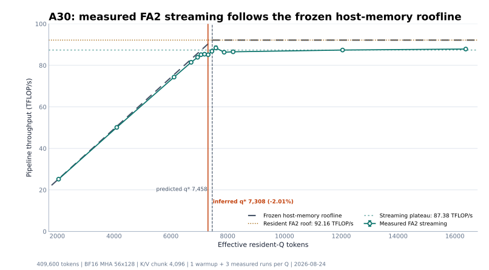
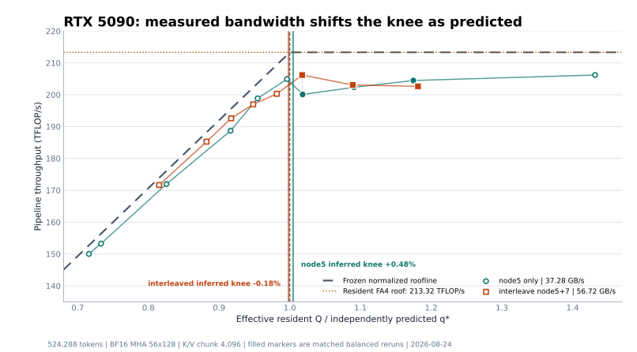

# seqattn-core

`seqattn-core` is an inference-only runtime for exact dense attention when the
complete Q/K/V working set does not fit in GPU memory. It keeps a bounded query
block in HBM, streams K/V from pinned host memory, and maintains the exact
online-softmax recurrence in FP32.

The package also provides a fixed-host-budget paged runtime for DRAM and aligned
NVMe stores. The distribution contains only `seqattn_core`; the former
compatibility facade is not shipped.

SeqAttn is integrated into ComfyUI through
[MiniMax H3 SeqAttn for ComfyUI](https://github.com/renlililoli/minimax-h3-seq-chunk-attn).

SeqAttn is under active development. Interfaces, performance characteristics,
and supported integrations may continue to change. If you encounter incorrect
results, crashes, installation failures, or hardware-specific regressions,
please open a [GitHub issue](https://github.com/renlililoli/stream-attn/issues)
with the GPU, software versions, configuration, and a minimal reproduction.

## Latest validation: 2026-08-26

The figures below are regenerated from the checked-in final observations with
[`benchmarks/plot_latest_readme_results.py`](benchmarks/plot_latest_readme_results.py).
They intentionally exclude contaminated runs and measurements that do not match
the documented timing boundary or fixed experiment configuration.

### NVIDIA A30: complete host-memory roofline sweep

<p align="center">
  
</p>

The A30 experiment fixes the sequence at 409,600 tokens and the K/V chunk at
4,096 tokens, then varies only the resident Q chunk. The prediction was frozen
from an independent concurrent H2D calibration and a resident FA2 measurement
before the randomized 14-point sweep.

| Quantity | Final value |
|---|---:|
| Shape | BF16 MHA, 56 heads, head dimension 128 |
| Concurrent H2D roof | 12.3577 GB/s |
| Resident FA2 roof | 92.1634 TFLOP/s |
| Streaming plateau | 87.3816 TFLOP/s |
| Predicted knee | 7,457.99 effective Q tokens |
| Inferred knee | 7,307.76 effective Q tokens |
| Knee difference | -2.01% |

The low-Q points follow the independently frozen bandwidth branch within about
2%. Above the knee, throughput settles near 87-88 TFLOP/s, or about 94.8% of
the complete resident FA2 roof. Each Q point used one warmup and three measured
executions in one randomized process.

Full protocol and observations:
[A30 host-memory roofline report](docs/a30_host_memory_roofline_experiment0_2026-08-24.md).

### NVIDIA RTX 5090: distinct knees for two host-memory policies

<p align="center">
  
</p>

The RTX 5090 experiment fixes the sequence at 524,288 tokens, the K/V chunk at
4,096 tokens, and the resident FA4 roof at 213.3230 TFLOP/s. Pinned-memory
placement is the only changed policy. Because the two policies have different
measured host-memory bandwidth, the chart normalizes each series by its own
independently predicted knee.

| Host-memory policy | Concurrent H2D | Predicted knee | Inferred knee | Difference | Plateau |
|---|---:|---:|---:|---:|---:|
| `membind=5` | 37.2840 GB/s | 5,721.56 | 5,748.77 | +0.48% | 203.411 TFLOP/s |
| `interleave=5,7` | 56.7170 GB/s | 3,761.18 | 3,754.30 | -0.18% | 203.072 TFLOP/s |

At the same requested `q=4096`, throughput increases from 150.02 TFLOP/s with
`membind=5` to 203.07 TFLOP/s with `interleave=5,7`, a 35.4% gain. The final
balanced reruns use `q=5888,6272,6784` for the single-node policy and
`q=3840,4096,4480` for the interleaved policy. Each Q value ran in a fresh
process with one warmup and three measured executions; contaminated runs are
excluded from the final observations.

Full protocol and observations:
[RTX 5090 host-memory roofline report](docs/rtx5090_host_memory_roofline_experiment0_2026-08-24.md).

Both experiments currently have one independent process per Q point. The knee
agreement supports the host-memory roofline model, but additional independent
process rounds are still required to quantify run-to-run and thermal variance.

## Backends

The contiguous host-memory runner has one shared copy/compute schedule and FP32
log-sum-exp combine path. A backend supplies the partial attention result for
one resident Q tile and one streamed K/V tile.

| Backend | Implementation | Availability |
|---|---|---|
| `builtin` | SeqAttn Triton update/finalize kernels | Included with the CUDA extra |
| `fa2` | FlashAttention 2 partial forward | Optional `flash-attn` package |
| `fa3` | FlashAttention 3 partial forward | Optional FA3 package |
| `fa4` | FlashAttention 4 CuTe partial forward | Optional `flash-attn-4` package |
| `reference` | CPU FP32 online-softmax reference | Always available |

`StreamingAttentionConfig.backend=None` checks, in order, the explicit Python
argument, `SEQATTN_BACKEND`, `SEQATTN_CONFIG`, the default user TOML file, and
then the architecture-aware automatic policy.

| Compute capability | Automatic preference order |
|---|---|
| SM80-SM89 | `fa2`, `builtin`, `reference` |
| SM90-SM99 | `fa3`, `fa2`, `builtin`, `reference` |
| SM100-SM109 | `fa4`, `builtin`, `reference` |
| SM120+ | `builtin`, `fa4`, `reference` |

Explicit backend selection fails when the dependency or GPU capability is not
available. The paged and projected-output runtimes currently use the built-in
kernel or the reference implementation. See
[backend selection and validation](docs/backend_selection.md) for the full
policy and adapter contracts.

## Installation

```bash
pip install -e '.[cuda]'
```

MiniMax-H3 DiT integrations should request the dedicated extra:

```bash
pip install -e '.[dit]'
```

Both extras install the Triton runtime. The `dit` name declares that the
consumer uses the public H3 block API rather than depending only on the generic
attention surface.

The supported platform is Linux with Python 3.10+, PyTorch 2.5+, CUDA, and
Triton 3.1+. FlashAttention packages are optional and selected only when the
requested backend and GPU architecture are compatible.

The release wheel contains the runtime only. Benchmark modules, command-line
entry points, plotting dependencies, experiment data, and reports remain in
the source repository and are not installed with the package.

## Quick start

The functional API accepts pinned CPU tensors and returns a CPU tensor. Packed
Q/K/V use `[total_tokens, heads, head_dim]` layout.

```python
import torch

from seqattn_core import StreamingAttentionConfig, streaming_attn_varlen_func

tokens = 61_312
q = torch.randn(tokens, 56, 128, dtype=torch.bfloat16, pin_memory=True)
k = torch.randn(tokens, 56, 128, dtype=torch.bfloat16, pin_memory=True)
v = torch.randn(tokens, 56, 128, dtype=torch.bfloat16, pin_memory=True)
cu = torch.tensor([0, tokens], dtype=torch.int32)

out = streaming_attn_varlen_func(
    q,
    k,
    v,
    cu,
    cu,
    max_seqlen_q=tokens,
    max_seqlen_k=tokens,
    causal=False,
    config=StreamingAttentionConfig(
        workspace_budget_bytes=4 * 2**30,
        kv_chunk_tokens=4096,
        backend="auto",
    ),
)
```

For repeated layers or denoise steps, build one plan and reuse one runner so
its buffers, streams, and CUDA events remain allocated:

```python
from seqattn_core import StreamingAttentionRunner, build_plan

config = StreamingAttentionConfig(
    workspace_budget_bytes=4 * 2**30,
    kv_chunk_tokens=4096,
)
plan = build_plan(
    q_heads=56,
    kv_heads=56,
    head_dim=128,
    dtype=torch.bfloat16,
    device="cuda",
    max_q_tokens=tokens,
    max_kv_tokens=tokens,
    config=config,
)
runner = StreamingAttentionRunner(plan, config)
out = torch.empty_like(q).pin_memory()
runner(q, k, v, cu, cu, out=out)
```

Passing a reusable pinned output buffer avoids host-allocation jitter in short
or repeated calls. `workspace_budget_bytes` covers only operator-owned CUDA
buffers; callers must reserve separate memory for the CUDA context, weights,
and other activations.

## Choosing chunk sizes

`q_chunk_tokens` should be selected from the measured intersection of the
concurrent pinned-host H2D roof and the effective resident attention compute
roof. It should not be copied from another machine or derived from theoretical
PCIe bandwidth or advertised GPU peak TFLOPS. Keep `kv_chunk_tokens=4096` for
the initial calibration; projection and MLP tiles are secondary integration
parameters that should be tuned only after the attention roofline is fixed.

See [the chunk-size calibration guide](docs/q_chunk_calibration.md) for the
formula, bandwidth and resident-backend commands, Q sweep procedure, NUMA
considerations, memory checks, and the validated RTX 5090 examples.

Multi-GPU planning and H3 execution are distributed separately in
`seqattn-multigpu`. Core-only installations do not import or expose those
APIs. See `packages/seqattn-multigpu/README.md` for installation and usage.

## Core APIs

- `streaming_attn_func` and `streaming_attn_varlen_func` provide dense and
  packed CPU-backed attention entry points.
- `StreamingAttentionRunner` reuses a planned contiguous host-memory pipeline.
- `ProjectedAttentionRunner` connects model-owned QKV and output-projection
  callbacks through sequence-sized pinned host Q/K/V without materializing raw
  attention output on the CPU.
- `RecomputedAttentionRunner` regenerates complete attention-sized Q and K/V
  tiles through direct-write callbacks and allocates no host Q/K/V.
- `H3MaterializedRunner` and `H3RecomputeRunner` provide explicit MiniMax-H3
  block policies with one-hidden in-place and two-hidden ping-pong contracts,
  respectively.
- `PagedAttentionRunner` executes through `PageSource` and `PageSink` under a
  fixed operator-owned host-memory budget.
- `NvmeQKVWriter`, `NvmeQKVStore`, and `NvmeOutputSink` provide aligned,
  atomically published persistent stores.

The built-in CUDA path keeps Q resident, streams K/V through a two- or
three-slot H2D ring, updates FP32 `(max, normalizer, accumulator)` state, then
normalizes and copies each completed output block to its sink. Packed sequence
boundaries are scheduler boundaries, and causal positions use bottom-right
alignment for unequal Q/K lengths.

See [architecture notes](docs/architecture.md) for package boundaries, memory
hierarchy, recurrence details, and pipeline invariants. The split DiT storage
policies and direct-write projector contracts are documented in
[DiT QKV recompute architecture](docs/dit_qkv_recompute_architecture.md).

## Paging and NVMe

The paged API does not require complete CPU Q/K/V tensors. `PageSource` fills
preallocated staging buffers, while `PageSink` consumes completed output pages.
The default policy assigns an 8 GiB operator-owned host budget across pinned
staging, direct-I/O bounce buffers, fixed metadata, and a bounded DRAM K/V
cache.

```python
from seqattn_core import (
    NvmeOutputSink,
    NvmeQKVStore,
    PagedAttentionConfig,
    PagedAttentionRunner,
    StreamingAttentionConfig,
)

store = NvmeQKVStore("/local-nvme/request-17", direct_io=True)
config = PagedAttentionConfig(
    host_memory_budget_bytes=8 * 2**30,
    direct_io=True,
    kv_storage_dtype="bf16",
    attention=StreamingAttentionConfig(
        workspace_budget_bytes=2 * 2**30,
        backend="builtin",
    ),
)
runner = PagedAttentionRunner(config, device="cuda")
runner.run(
    store,
    store,
    cu_seqlens_q,
    cu_seqlens_k,
    NvmeOutputSink("/local-nvme/request-17-output", direct_io=True),
)
```

BF16 and FP16 stores are exact modes. INT8 K/V is explicitly approximate and
uses symmetric quantization with FP16 scales per 64 tokens and KV head. Direct
I/O failures are reported; the runtime never silently falls back to buffered
I/O. See [the paged CPU/NVMe runtime](docs/paged_nvme_runtime.md) for storage
layout, budget accounting, failure behavior, and measurement policy.

## Benchmarks

Run each timing point in an independent process and keep input generation
outside the attention interval:

```bash
PYTHONPATH=src python -m seqattn_core.benchmarking.streaming \
  --mode seqattn \
  --tokens 61312 \
  --q-heads 56 --kv-heads 56 --head-dim 128 \
  --workspace-mib 4096 --kv-chunk 4096 \
  --warmup 1 --repeats 3 \
  --output benchmark-results/seqattn_61312.json
```

The source repository also contains resident, paged, and projection benchmark
modules under `seqattn_core.benchmarking`. Install their repository-only
dependencies with `pip install -r benchmarks/requirements.txt`. Benchmark JSON
records configuration, wall and CUDA-event timing, effective throughput,
planned workspace, transfer volume, and memory peaks where applicable.

Regenerate the core README figures from the checked-in final observations:

```bash
python benchmarks/plot_latest_readme_results.py
```

## Correctness and limits

```bash
pytest -q
```

The tests cover uneven tiles, empty packed segments, causal alignment, MHA,
GQA, cross-segment isolation, FP16/BF16 parity, page and store validation,
memory-budget enforcement, and runner reuse.

Current scope:

- Linux, inference-only dense attention. Core contiguous DRAM, projected,
  recompute, paged, and NVMe execution is single-GPU. Multi-GPU execution is
  available only through the separately installed `seqattn-multigpu` plugin.
- No backward pass, dropout, arbitrary sparse masks, model-weight paging,
  cross-request HBM residency, io_uring, or GPUDirect Storage.
- Caller-owned complete tensors used through memory adapters are outside the
  paged operator's host-memory accounting.
- Physical NVMe performance claims require a separately validated local device;
  simulated NVMe results are functional pipeline measurements only.

Version suffixes communicate maturity: `.devN` is a development snapshot,
`aN` is a minimum feature-complete Alpha release, and an unsuffixed version is
reserved for a stable release after API stabilization.
