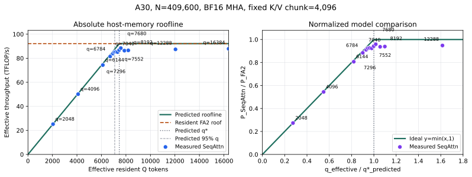

# A30 Host-Memory Roofline Experiment 0

Date: 2026-08-24

Status: the first randomized 14-point Q sweep is complete. Independent process
replication and profiler captures remain future validation work.

## Question

For exact non-causal BF16 MHA with a fixed 4,096-token K/V chunk, does the A30
FA2 streaming path follow the independently calibrated host-memory roofline

```text
P(q) = min(B_P * q_effective / 1000, P_FA2)?
```

The workspace guardrail is fixed at 4 GiB and only resident Q is varied. The
prediction was frozen before the Q sweep started.

<p align="center">
  
</p>

## Locked Shape

```text
GPU:             NVIDIA A30, SM80, physical GPU0
tokens:          409,600
Q/K/V heads:     56 / 56 / 56 (MHA)
head dimension:  128
dtype:           BF16
causal:          false
KV chunk:        4,096
KV buffers:      2
output:          pinned host DRAM
workspace:       4 GiB guardrail
```

Input tensors are generated deterministically in pinned DRAM with 32 CPU
workers and 4,096-token chunks. Data preparation is outside attention timing.

## Independent Inputs

| Input | Measurement | Frozen value |
|---|---|---:|
| `B_P` | Equal-weight median of concurrent FA2 partial-forward H2D medians at `q_compute=8192` and `16384` | 12.3577 GB/s |
| `P_FA2` | Median of 10 CUDA-event resident FA2 samples at the complete 409,600-token shape after 5 warmups | 92.1634 TFLOP/s |

The prospective prediction is:

```text
q_star_predicted = 7,457.99
q_95_predicted   = 7,085.09
q_star_aligned   = 7,552
workspace(q=7552, k=4096) = 672.2265625 MiB
```

The machine-readable pre-registration is
[`prediction.json`](experiments/a30_host_memory_roofline_experiment0_20260824/prediction.json).

## Observations

Each point uses one warmup and three measured executions in the same process.
The primary throughput is the compute-pipeline CUDA-event interval. The table
uses the exact finite-N effective Q after the query-pass staircase.

| Requested q | Effective q | Q passes | Predicted TFLOPS | Pipeline TFLOPS | Measured / predicted | Measured / FA2 |
|---:|---:|---:|---:|---:|---:|---:|
| 2,048 | 2,048.0 | 200 | 25.31 | 25.19 | 99.53% | 27.33% |
| 4,096 | 4,096.0 | 100 | 50.62 | 50.12 | 99.01% | 54.38% |
| 6,144 | 6,113.4 | 67 | 75.55 | 74.34 | 98.41% | 80.66% |
| 6,784 | 6,714.8 | 61 | 82.98 | 81.48 | 98.19% | 88.40% |
| 7,040 | 6,942.4 | 59 | 85.79 | 83.89 | 97.78% | 91.02% |
| 7,168 | 7,062.1 | 58 | 87.27 | 85.15 | 97.57% | 92.39% |
| 7,296 | 7,186.0 | 57 | 88.80 | 85.37 | 96.13% | 92.63% |
| 7,424 | 7,314.3 | 56 | 90.39 | 85.11 | 94.17% | 92.35% |
| 7,552 | 7,447.3 | 55 | 92.03 | 86.82 | 94.34% | 94.20% |
| 7,680 | 7,585.2 | 54 | 92.16 | 88.40 | 95.91% | 95.91% |
| 7,936 | 7,876.9 | 52 | 92.16 | 86.33 | 93.67% | 93.67% |
| 8,192 | 8,192.0 | 50 | 92.16 | 86.53 | 93.89% | 93.89% |
| 12,288 | 12,047.1 | 34 | 92.16 | 87.38 | 94.81% | 94.81% |
| 16,384 | 16,384.0 | 25 | 92.16 | 87.86 | 95.33% | 95.33% |

The four lowest-Q points follow the independently predicted bandwidth branch
within 0.47% to 1.81%. Accuracy remains within 2.43% through `q=7168`, before
the curve transitions to the streaming plateau.

The five points with `q_effective >= q_star_predicted` span 86.33-88.40
TFLOP/s. Their median is 87.38 TFLOP/s, giving the cross-kernel efficiency
factor

```text
eta = P_SeqAttn,plateau / P_FA2 = 0.9481
```

This approximately 5.2% gap measures the difference between complete resident
FA2 and the externally split FA2 streaming path; it is not an H2D deficit.
Concurrent FA2 H2D retains the full measured 12.36 GB/s copy rate.

## Observed Knee

Define the observed knee as the first ascending Q point reaching 95% of the
measured high-Q plateau:

```text
measured plateau:              87.3816 TFLOP/s
95% plateau threshold:         83.0125 TFLOP/s
first point above threshold:   requested q=7040
effective q at threshold:      6942.37
inferred full intersection:    6942.37 / 0.95 = 7307.76
predicted full intersection:   7457.99
intersection difference:       -2.01%
```

The observed transition therefore lands close to the independently frozen
prediction. Below the knee, the data follows `B_P * q_effective`; above it,
throughput is limited by the approximately 87-88 TFLOP/s streaming operator
plateau rather than the 92.16 TFLOP/s complete resident FA2 roof.

## Conclusion

The first complete sweep supports the A30 host-memory roofline model. The
PCIe-limited branch predicts low-Q throughput within 2%, and the predicted
intersection is within about 2% of the knee inferred from the measured
streaming plateau. The remaining systematic difference is a roughly 0.948
cross-kernel efficiency factor between streamed split FA2 and resident FA2.

These results come from one randomized process with three measured repeats per
Q. Independent process rounds are still required to quantify run-to-run and
thermal variation before treating the plateau and knee estimates as final
publication values.

## Artifacts

```text
Frozen prediction:
docs/experiments/a30_host_memory_roofline_experiment0_20260824/prediction.json

Observations:
docs/experiments/a30_host_memory_roofline_experiment0_20260824/observations.json

Figure:
docs/assets/a30-host-memory-roofline-experiment0.svg

Raw experiment:
workspace/benchmarks/results/a30_host_memory_roofline_experiment0_20260824/
```

The figure and observation summary are regenerated with
`benchmarks/analyze_a30_host_memory_roofline.py`.
