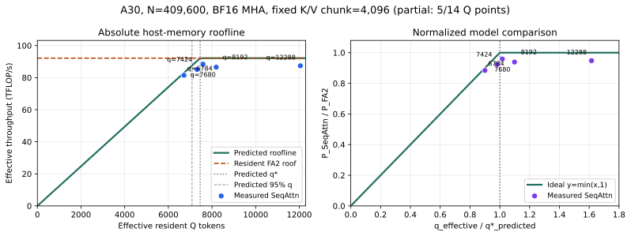

# A30 Host-Memory Roofline Experiment 0

Date: 2026-08-24

Status: in progress. This partial report freezes the first five completed
points from a 14-point Q sweep. The background sweep is still running, so the
figure and observations below must not be treated as the final result.

## Question

For exact non-causal BF16 MHA with a fixed 4,096-token K/V chunk, does the A30
FA2 streaming path follow the independently calibrated host-memory roofline

```text
P(q) = min(B_P * q_effective / 1000, P_FA2)?
```

The workspace guardrail is fixed at 4 GiB and only resident Q is varied. The
prediction was frozen before the Q sweep started.

<p align="center">
  
</p>

## Locked Shape

```text
GPU:             NVIDIA A30, SM80, physical GPU0
tokens:          409,600
Q/K/V heads:     56 / 56 / 56 (MHA)
head dimension:  128
dtype:           BF16
causal:          false
KV chunk:        4,096
KV buffers:      2
output:          pinned host DRAM
workspace:       4 GiB guardrail
```

Input tensors are generated deterministically in pinned DRAM with 32 CPU
workers and 4,096-token chunks. Data preparation is outside attention timing.

## Independent Inputs

| Input | Measurement | Frozen value |
|---|---|---:|
| `B_P` | Equal-weight median of concurrent FA2 partial-forward H2D medians at `q_compute=8192` and `16384` | 12.3577 GB/s |
| `P_FA2` | Median of 10 CUDA-event resident FA2 samples at the complete 409,600-token shape after 5 warmups | 92.1634 TFLOP/s |

The prospective prediction is:

```text
q_star_predicted = 7,457.99
q_95_predicted   = 7,085.09
q_star_aligned   = 7,552
workspace(q=7552, k=4096) = 672.2265625 MiB
```

The machine-readable pre-registration is
[`prediction.json`](experiments/a30_host_memory_roofline_experiment0_20260824/prediction.json).

## Partial Observations

Each point uses one warmup and three measured executions in the same process.
The primary throughput is the compute-pipeline CUDA-event interval. The table
uses the exact finite-N effective Q after the query-pass staircase.

| Requested q | Effective q | Q passes | Predicted TFLOPS | Pipeline TFLOPS | Measured / predicted | Measured / FA2 |
|---:|---:|---:|---:|---:|---:|---:|
| 6,784 | 6,714.8 | 61 | 82.98 | 81.48 | 98.19% | 88.40% |
| 7,424 | 7,314.3 | 56 | 90.39 | 85.11 | 94.17% | 92.35% |
| 7,680 | 7,585.2 | 54 | 92.16 | 88.40 | 95.91% | 95.91% |
| 8,192 | 8,192.0 | 50 | 92.16 | 86.53 | 93.89% | 93.89% |
| 12,288 | 12,047.1 | 34 | 92.16 | 87.38 | 94.81% | 94.81% |

The first point below the predicted intersection follows the bandwidth branch
within 1.81%. The current three high-Q points span 86.53-88.40 TFLOP/s. Their
median is 87.38 TFLOP/s, giving the preliminary cross-kernel efficiency factor

```text
eta_partial = P_SeqAttn,plateau / P_FA2 = 0.9481
```

This resembles the RTX 5090 experiment's small gap between the independently
measured resident FlashAttention roof and the streaming plateau. It is too
early to freeze an A30 `eta` or observed knee: `q=2048` is currently running,
and the remaining fine points around 7K-8K are still pending.

## Current Interpretation

The partial data supports the host-memory slope below the predicted knee and a
transition to an approximately 87-88 TFLOP/s streaming plateau near the
predicted 7.5K-token intersection. The complete sweep is required to separate
the stable plateau from execution-order, thermal, and finite-Q kernel effects.

## Artifacts

```text
Frozen prediction:
docs/experiments/a30_host_memory_roofline_experiment0_20260824/prediction.json

Partial observations:
docs/experiments/a30_host_memory_roofline_experiment0_20260824/observations.partial.json

Partial figure:
docs/assets/a30-host-memory-roofline-experiment0-partial.svg

Raw live experiment:
workspace/benchmarks/results/a30_host_memory_roofline_experiment0_20260824/
```

The partial figure and observation summary are regenerated with
`benchmarks/analyze_a30_host_memory_roofline.py`.
