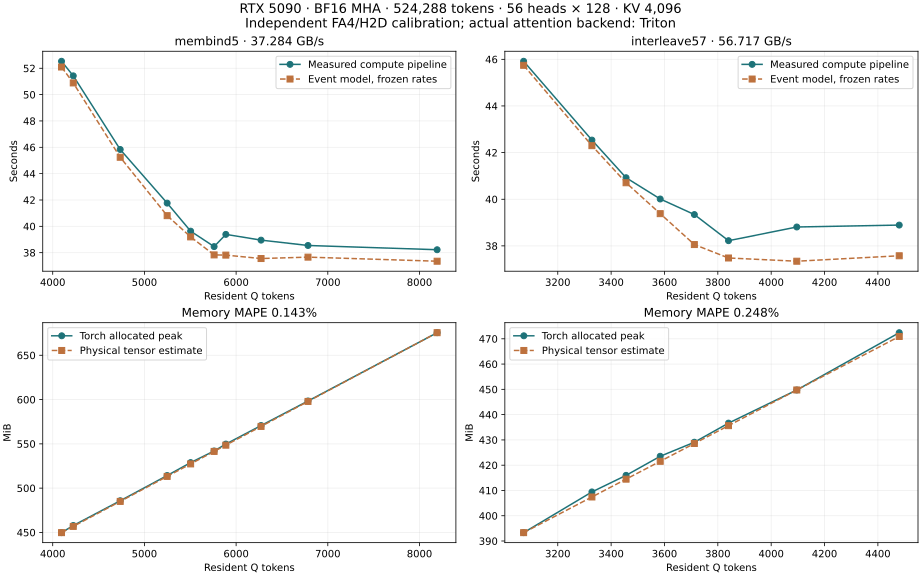

# RTX 5090 activation estimator validation

Comparison date: 2026-09-08. Measurements were retained from August 2026.
No new GPU measurements were taken for this comparison.

## Result and scope

The new offline **event scheduler and physical buffer accounting** were replayed
against 18 pure-attention measurements, using independently frozen resident FA4
throughput and concurrent H2D bandwidth. Another six KV=2048 points validate
memory only. This does not validate the complete projected block template's
GEMM, FFN, callback memory or device-specific compiled schedules.

| Comparison | Points | Mean absolute percentage error | Maximum absolute percentage error |
|---|---:|---:|---:|
| H2D/attention event estimate vs measured compute pipeline | 18 | 1.9867% | 3.9963% |
| Physical tensor bytes vs Torch allocated peak | 24 | 0.1996% | 0.5652% |

All timing errors are negative: the model predicts execution 0.3784–3.9963%
faster than measured. Memory errors range from exact to a 2 MiB underprediction.
Signed error is `(predicted / measured - 1) * 100`; MAPE averages its absolute
value over the individual retained points, without fitting a correction factor.



Canonical observations and computed errors:
[`validation.json`](experiments/rtx5090_activation_estimator_validation_20260908/validation.json).
It records source hashes, frozen calibration hashes, estimator source hashes,
individual comparisons, capacity selection, and excluded H3 scope mismatches.

## Matching configuration and independent inputs

| Property | Value |
|---|---|
| Accelerator | NVIDIA GeForce RTX 5090, SM120 |
| Workload | 524,288 tokens, one non-causal segment, BF16 MHA |
| Heads and dimension | 56 Q/KV heads, dimension 128 |
| Streaming backend | SeqAttn built-in Triton |
| Kernel launch | block M=128, N=64, 8 warps, 3 stages |
| Buffers | 2 K/V slots, 1 output slot |
| KV tile for timing validation | 4,096 tokens |
| Resident compute calibration | FA4 4.0.0b26, 213.32300375 TFLOP/s |
| Runtime environment | PyTorch 2.10.0+cu128, CUDA 12.8 |

| Policy | Concurrent H2D | Q points | Time MAPE | Memory MAPE |
|---|---:|---:|---:|---:|
| `membind=5` | 37.28403455 GB/s | 10 | 2.0348% | 0.1429% |
| `interleave=5,7` | 56.71701217 GB/s | 8 | 1.9267% | 0.2480% |

The calibration JSON files predate the Q sweep, and their SHA-256 values match
the frozen predictions. None of the evaluation timings were used to set the
attention rate, bandwidth or launch latency. Backend, launch parameters, buffer
counts, dtype and shape match within each series. The resident rate is from
FA4 while the actual streamed execution uses Triton, following the original
experiment; this backend difference is explicit, not treated as identical code.

The original curated observations exclude contaminated runs. This comparison
retains that selection and records its excluded-Q information. There is one
independent process per Q point, with three or five timed repeats according to
the raw JSON. Reported measured time is the raw process's mean CUDA-event
`compute_pipeline_seconds`. These sample errors are not a universal error bound
for other shapes, topologies or devices.

## Event and memory model

`benchmarks/validate_activation_estimate_5090.py` constructs a pure-attention
`ExecutionSpec` for the new estimator:

- Q H2D once per resident-Q pass;
- every K/V tile transferred with two physical slots and explicit reuse hazards;
- attention updates serialized on one compute resource, overlapping H2D where
  dependencies permit;
- finite sequence tails and complete K/V rescans represented explicitly;
- persistent Q, K/V, FP32 accumulator/max/sum, and output storage.

This is an adaptation of the generic event engine to the benchmark's input
policy. It does not run `build_block_execution()` with invented GEMM inputs.

The time estimate omits explicit finalization, CPU launch overhead and output
copy waits because a clean, matching calibration for these terms was not
available for both topologies. The measured compute pipeline includes those
costs up to its compute-stream end event. Aggregate records cannot attribute the
remaining timing error precisely. The older ideal roofline formula, also
retained in the JSON, has a 3.2673% aggregate time MAPE on these 18 points; the
event model adds finite-pass and Q-transfer costs and reduces it to 1.9867%.

Memory is calculated independently from tensor shapes, not copied from the
recorded plan estimate. The 32 MiB fixed reserve is an accounting allowance,
not an allocated tensor; it is excluded when comparing to Torch allocated.
Adding it back reproduces the recorded attention workspace estimates exactly.
Caller CPU tensors, weights, CUDA context, allocator cached/reserved pages and
unlisted callback allocations are not part of this device-tensor comparison.

Six additional 524K-token points with KV=2048 check the same memory formula,
covering Q=1920 through Q=13568. Their timings are excluded because no matching
KV=2048 bandwidth calibration was frozen for this comparison. Across all 24
points the predicted allocation ranges from 217.82 to 859.80 MiB, and the
observed peaks differ by 0–2 MiB.

The source Q sweeps skipped the separate NVML memory-probe pass, but retained
Torch allocator peaks. This validates the total allocated-memory peak, **not**
per-buffer timestamp/lifetime accuracy, allocator reserved memory, or an NVML
whole-process peak. The generated HTML timelines remain labeled predicted.

## Minimum memory at a performance target

For a fair common absolute target, use 95% of the frozen FA4 roof:
**202.656854 TFLOP/s**. Among the measured Q candidates:

| Policy | Predicted minimum Q | Observed minimum Q | Predicted allocation at selected Q | Observed allocation at required Q |
|---|---:|---:|---:|---:|
| `membind=5` | 5760 | 5760 | 541.46 MiB | 541.98 MiB |
| `interleave=5,7` | 3712 | 3840 | 428.59 MiB | 436.64 MiB |

The interleaved case underselects Q by one 128-token block. The minimum-memory
estimate is 8.05 MiB, or 1.84%, below the observed allocation needed for this
common throughput target. This distinction matters: accurate buffer accounting
at a specified Q does not guarantee an equally accurate performance knee.

The API's default rule instead compares 95% of each candidate set's own best
predicted throughput. Applying the analogous rule separately to measured
throughput gives:

| Policy | Predicted minimum Q | Observed minimum Q | Predicted / observed minimum allocation |
|---|---:|---:|---:|
| `membind=5` | 5504 | 5504 | 527.35 / 528.85 MiB |
| `interleave=5,7` | 3712 | 3584 | 428.59 / 423.53 MiB |

These relative targets are different absolute throughputs (about 200.5 versus
195.9 TFLOP/s), so their Q selections must not be presented as a common absolute
SLA. Both definitions and thresholds are recorded in JSON. All minima are over
the retained candidates, not a proof over every possible aligned Q.

## Why this does not yet certify the full H3 block estimate

A subsequent search found an additional parent-project dataset that the initial
`h3` name filter missed: 11 JSON files and two SQLite captures in
`workspace/benchmarks/results/seqattn_single_block25_81159_20260825`. It includes
complete block timings, native CUDA-event stage timings and seven variants with
Torch peaks. See the [updated H3 evidence audit](benchmark_h3_block25_estimator_audit_2026-09-08.md).
The earlier search was incomplete; the remaining limitation is matching this
block's carry-based FFN schedule, tile-dependent operators and allocation
ownership to the estimator, not the absence of H3 block measurements. The
following six files are the older local recompute subset only.

Six local H3 JSON files exist under
`benchmarks/results/h3_qkv_recompute_20260827/`, including two smoke runs. They
cannot establish a matched current whole-block estimator error:

- The old recompute implementation subdivides projection. At Q=3840 the raw
  result records 137 Q projection calls and 8,901 K/V calls; current direct-write
  tiling would issue 69 and 4,485. At Q=196608 the old records show 129 and 258
  calls, versus 2 and 130 for the current contract. These timings cannot be
  silently treated as current recompute observations.
- The old JSON has core workspace plus Torch/NVML whole-process peaks, without
  an isolated activation-only peak or a matched independent GEMM profile. Their
  difference includes unmodeled ownership and is not an estimator percentage
  error. For example materialized Q=16384 records 1,090,519,040 bytes of core
  workspace and 2,711,075,328 bytes of Torch allocated peak.
- The generic block template reserves distinct host input/output hidden arrays.
  The H3 materialized benchmark updates one hidden array in place. Thus its
  generic logical host reservation is 20% higher (16,948,592,640 versus
  14,123,827,200 bytes); this is an ownership-policy mismatch, not RSS error.
- The newer 2K/4K direct-write study is summarized in
  [`benchmark_h3_qkv_recompute_profile_2026-08-27.md`](benchmark_h3_qkv_recompute_profile_2026-08-27.md),
  but the formal and profile JSON files listed there were no longer present
  under `/tmp` during this audit. Nsight attribution was not substituted for
  primary latency data or used to fit the evaluation points.

The subsequent [full H3 model](activation_memory_estimation.md) now matches the
carry schedule and models the callback tensors. See
[its validation report](benchmark_h3_full_estimator_2026-09-08.md). Timing calibration
still needs matching current execution, per-shape
attention/GEMM calibration, explicit callback/alias ownership, and allocated
memory measured separately from weights/context. No default Q, tile or device
profile is promoted by this comparison.

## Reproduce

The external raw evidence remains in the parent project's
`workspace/benchmarks/results`; it is read-only during validation. From this
repository's development environment:

```bash
PYTHONPATH=src python benchmarks/validate_activation_estimate_5090.py \
  --evidence-root ../../workspace/benchmarks/results \
  --output-dir /tmp/seqattn-5090-estimate-validation
```

The command validates calibration hashes, replays all curated timing points,
checks memory, and writes JSON, PNG/SVG comparisons and one predicted HTML
execution timeline per topology. It also retains intermediate per-series JSON.
No accelerator kernels or model loaders are invoked. Large-trace scheduling
uses a binary search over resource reservations; a regression test checks its
gap selection against exhaustive search.
