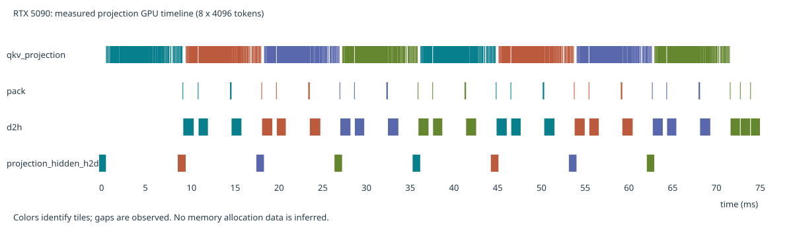

# Actual RTX 5090 QKV projection overlap — September 9, 2026

The real production H3 projection path overlaps QKV writeback with later
projection computation. The previous estimator incorrectly made all packing
kernels mutually exclusive with GEMM and omitted a blocking host submission gate
inside RoPE. Both behaviors are now represented explicitly.



This figure uses actual Nsight GPU kernel/memcpy intervals, attributed through
CUDA correlation IDs to the producer's NVTX ranges. Colors identify tiles.
The compute row includes all projection callback kernels, not only GEMM.
No memory allocation values are inferred from these timestamps.

## Protocol

- RTX 5090 GPU 3, UUID `GPU-35d69b8c-779a-bb45-263c-27587354c413`, idle before each run.
- Real checkpoint block 25; production modulated INT8 ConvRot callback, no LoRA.
- 4096 projection tile, two projection slots, BF16 hidden width 5376,
  56 heads × 128, RoPE width 96.
- CPU affinity `160-191,416-447`, NUMA `interleave=5,7`.
- PyTorch `2.10.0+cu128`, CUDA 12.8, Triton 3.6.0.
- Each process warms up three times. Unprofiled processes measure five repeats.
- 32768-token measurement and Nsight capture run in independent processes.
- An independent 65536-token process validates the fixed behavioral model.
- Weights, modulation, host allocation and population precede timing.
- No model runtime code was optimized or modified for these measurements.
  The wrapper only enables NVTX ranges and adds tile attribution.

## Measured relationships

For the 8-tile capture, including fill and drain:

| GPU activity | Active time | Overlap with projection kernels | Fraction |
|---|---:|---:|---:|
| QKV D2H DMA | 26.953 ms | 22.147 ms | 82.17% |
| QKV packing kernels | 2.581 ms | 1.270 ms | 49.19% |

Packing really overlaps other GPU kernels; this is not merely overlap between
CPU enqueue ranges. Each of the eight callbacks also has a
`cudaStreamSynchronize` from the blocking position transfer in
`rope_freqs`: `position_ids.to(torch.float32).to(device)`. This blocks subsequent
CPU submissions even on the separate hidden H2D stream. Existing double-buffer
reuse waits and the final QKV barrier remain unchanged.

The capture's GPU span is 75.533 ms. It is diagnostic evidence only; the latency
comparison below uses the independent **unprofiled wall-time median**.

## Prediction validation, without refitting scalar rates

The comparison retains the September 8 frozen exact-shape operator profile and
changes only the host submission dependencies and packing resource mapping.
The preceding model is commit `6ffc7df` (already using earliest-ready scheduling).

| Tokens | Before prediction | Revised prediction | Actual median | Before error | Revised error |
|---|---:|---:|---:|---:|---:|
| 32768 | 98.623 ms | 75.424 ms | 73.858 ms | +33.53% | +2.12% |
| 65536 | 195.376 ms | 144.242 ms | 162.434 ms | +20.28% | -11.20% |

Raw 32K repeats: 82.000, 73.858, 73.648, 73.903, 73.738 ms.
Raw 64K repeats: 161.305, 162.387, 162.434, 163.050, 163.419 ms.
The slow first 32K repeat is retained. The 64K discrepancy is not hidden or fitted
away: the fixed scalar costs and coarse resource model still miss some workload
variation, launch gaps and/or contention. These measurements do not identify the
remaining cause or validate complete-block latency or memory-peak accuracy.

## Evidence and reproduction

[Measurements, GPU activities, CPU syncs, comparisons and source manifest](experiments/h3_projection_overlap_20260909/manifest.json)
are retained alongside the raw measurement JSONs and consumer driver source text.
The original `.nsys-rep` and SQLite remain at
`/tmp/seqattn-projection-observed-20260909/`; the manifest records their hashes.
Consumer driver source is evidence only and is not imported into core.

```bash
python benchmarks/analyze_projection_trace.py projection.sqlite \
  --output trace.json --svg projection.svg
PYTHONPATH=src python benchmarks/compare_projection_estimate.py \
  --profile docs/experiments/h3_full_block_524k_20260908/profile.json \
  --configuration docs/experiments/h3_full_block_524k_20260908/prediction_summary.json \
  --measurement docs/experiments/h3_projection_overlap_20260909/measurement_32768.json \
  --concurrent-pack --output comparison.json
```

The comparison reuses the materialization phase of the H3 graph builder. It does
not invent attention/FFN samples for tail shapes absent from the frozen profile.
The process shutdown printed an existing consumer `ModelPatcherDynamic.__del__`
warning after results were saved; all experiment containers exited successfully.
