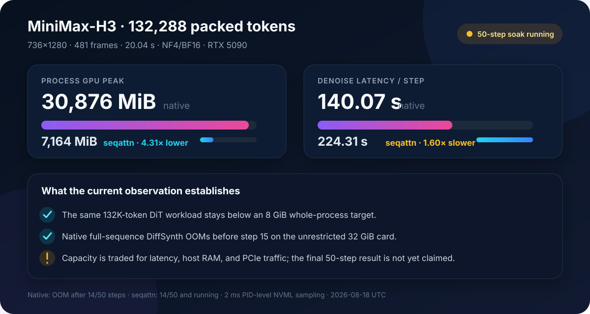
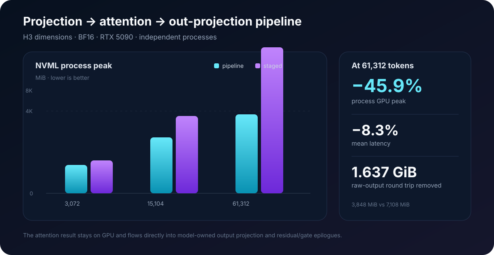

# MiniMax-H3 integration and long-video benchmark

## Executive summary

The MiniMax-H3 integration demonstrates the purpose of `seqattn` at model
scale: preserve exact dense attention semantics while moving sequence-sized
Q/K/V activations to CPU DRAM and bounding the GPU working set.

The strongest completed capacity result so far is a real H3-shaped,
132,288-token, full 50-block denoise forward under an 8GiB whole-process target:

| Metric | Measured value |
|---|---:|
| Requested video | 720×1280, 480 frames |
| Model-aligned video | 736×1280, 481 frames |
| Duration | 20.04 seconds at 24 fps |
| Packed sequence | **132,288 tokens** |
| DiT blocks | **50** |
| Denoise steps in completed probe | 1 |
| Denoise latency | **236.390 s** |
| PID-level NVML peak | **5,968 MiB** |
| Step-end process memory | 4,610 MiB |
| Torch allocated / reserved peak | 4,840 / 5,278 MiB |
| CPU RSS peak | 49,564 MiB (48.4 GiB) |
| Logical H2D | 1,708,147,058,688 bytes (1,591 GiB) |
| Logical D2H | 616,356,249,600 bytes (574 GiB) |
| Status | **success** |

This result establishes one complete denoise-forward capacity point.  It does
not yet establish completion of a 50-step video.  A separate dual-GPU 50-step
run is in progress and is reported below with an explicit live-data label.

<p align="center">
  
</p>

## What is integrated

The H3 branch connects `ProjectedAttentionRunner` to the model-owned operations
around attention:

```text
CPU hidden activation
  │
  ├─ chunk H2D
  ├─ NF4/BF16 QKV projection + Q/K norm + RoPE
  └─ pinned Q/K/V backing store
         │
         ├─ resident query super-block
         ├─ double-buffered K/V H2D
         └─ fused Triton QK + mask + online softmax + PV update
                │
                └─ GPU out projection + gate + residual
                       │
                       └─ projected hidden D2H
```

The attention output is never materialized as a complete CPU tensor and then
copied back solely for output projection.  The integration also phases the QKV
and output-projection weight leases so that these large weight groups do not
need to be resident together.

The remainder of the H3 block uses the existing two-pass CPU-backed MLP path.
The current implementation is inference-only and exact; backward, dropout, and
sparse attention are outside the V1 scope.

## Completed 61K controlled comparison

This comparison isolates whether making `seqattn` an independent package and
fusing the output consumer introduced an excessive integration cost.  The two
points ran serially on the same physical RTX 5090 with the same checkpoint,
input, seed, 8GiB target, 50 H3 blocks, and one denoise step.

| Metric | Prior `flash2_lse` streamed path | Independent `seqattn` | Delta |
|---|---:|---:|---:|
| Packed tokens | 61,056 | 61,056 | identical |
| Denoise latency | **67.750 s** | **71.182 s** | +5.07% |
| PID NVML peak | 5,522 MiB | **5,248 MiB** | −274 MiB |
| CPU RSS peak | 43,328 MiB | **41,845 MiB** | −1,483 MiB |
| Logical H2D | 656,996,616,192 B | **613,231,675,392 B** | −40.76 GiB |
| Logical D2H | 328,237,056,000 B | **284,472,115,200 B** | −40.76 GiB |
| Total logical PCIe | 985,233,672,192 B | **897,703,790,592 B** | **−81.52 GiB** |
| Status | success | success | — |

The independent Triton implementation is 5.07% slower than the prior local
FlashAttention-2-based streaming path at this point.  Package boundaries are
not the main cost: the remaining difference is principally kernel maturity.
In exchange, the new end-to-end consumer pipeline reduces peak device memory,
host RSS, and removes 81.5GiB of raw-attention round-trip traffic per denoise
step across the 50-block DiT.

Source JSON:

- `compare61k_seqattn_serial_q16384_480x832_f515_s1_20260818T031819Z.json`
- `compare61k_flash2_serial_q16384_480x832_f515_s1_20260818T032017Z.json`

## Projection pipeline microbenchmark

The operator-level benchmark compares the same Triton attention runtime with
and without direct output consumption.

| Tokens | Pipeline latency | Staged latency | Latency reduction | Pipeline peak | Staged peak | Peak reduction |
|---:|---:|---:|---:|---:|---:|---:|
| 3,072 | **12.35 ms** | 15.16 ms | 18.6% | **1,386 MiB** | 1,596 MiB | 210 MiB |
| 15,104 | **88.95 ms** | 102.15 ms | 12.9% | **2,718 MiB** | 3,758 MiB | 1,040 MiB |
| 61,312 | **843.44 ms** | 919.79 ms | 8.3% | **3,848 MiB** | 7,108 MiB | 3,260 MiB |

<p align="center">
  
</p>

At 61,312 tokens, direct output consumption eliminates a 1.637GiB logical raw
attention D2H→H2D round trip.  The measured peak falls by more than the raw
tensor size because the staged asynchronous path can retain several raw and
projected output allocations until their stream work completes.

## Live dual-GPU 50-step experiment

Status on **August 18, 2026 UTC**: in progress.

The two processes use separate physical RTX 5090 GPUs so they do not compete
for HBM or GPU compute.  They use the same image, checkpoint, prompt, seed,
requested shape, and 50-step scheduler.  CPU affinity is disjoint.  The
`seqattn` process has an 8,192MiB whole-process target; native DiffSynth has no
artificial memory limit.  GPU memory is sampled for the current PID every 2ms.

| Live snapshot | Native DiffSynth | `seqattn` 8GiB target |
|---|---:|---:|
| Completed denoise steps | **14 / 50, then OOM** | **14 / 50, still running** |
| Mean step through step 14 | **140.068 s** | about 224.31 s |
| Latest observed process peak | 30,876 MiB | **7,164 MiB** |
| Latest step-end memory | 30,876 MiB | **4,432 MiB** |
| Relative peak memory | 100% | **23.2%** |
| Relative latency | 1.00× | 1.60× |

The native result is now final: status `oom`, 14 completed steps, 30,876MiB
PID-level NVML peak, and a failed 3.53GiB allocation in the full-sequence MLP
gate/up product while starting step 15.  There was no artificial native VRAM
limit.  Its reserved memory rises gradually from 30,206MiB after step 1 to
30,254MiB after step 14 while allocated memory at the sampled boundaries varies
between 1,312MiB and 4,223MiB.

At the matching 14-step checkpoint, `seqattn` remains below the strict 8GiB
target.  Its step-end value stays at 4,432–4,434MiB and its within-step peak at
7,160–7,164MiB.  This is the strongest current capacity comparison: native is
faster per successful step but cannot finish the requested workload on the
32GiB card, while the 8GiB-target `seqattn` process continues.  A final
`seqattn` completion, decode, or media claim still waits for all 50 steps,
video/audio VAE decode, and MP4 mux.

Native result JSON:

- `final_720p20s_native_unlimited_gpu1_720x1280_f480_s50_20260818T033056Z.json`

## Measurement protocol

- Model: MiniMax-H3 FL2VA NF4.
- Compute dtype: BF16.
- Weight backing: CPU DRAM offload; no disk offload.
- GPU: NVIDIA GeForce RTX 5090, CUDA 12.8, PyTorch 2.10.0+cu128.
- `seqattn` workspace: 2,048MiB; K/V tile: 4,096 tokens.
- Whole-process target: 8,192MiB.
- PyTorch allocator limit: target minus measured CUDA-context memory and a
  128MiB safety margin.
- Memory source of record: PID-level NVML sampling, not Torch peak alone.
- Sampling interval: 2ms for the 132K experiments and 5ms for the 61K serial
  comparison.
- Logical H2D/D2H bytes are instrumented operator traffic and should not be
  interpreted as measured PCIe-link throughput.
- Each completed comparison point is a single measured run; no error bars or
  statistical-significance claim is made.

## Interpretation and limits

The data supports a narrow, useful claim:

> `seqattn` substantially lowers the GPU capacity required for exact dense H3
> attention, allowing a 132K-token, 20-second workload to execute below an 8GiB
> whole-process target where native full-sequence execution consumes nearly the
> entire 32GiB RTX 5090.

It does not support a claim that `seqattn` is faster than native FlashAttention
when the full sequence fits.  Current costs include repeated K/V transfer for
each resident-Q super-block, larger CPU activation storage, and a Triton kernel
that is less mature than FlashAttention 2.  The main optimization opportunities
are larger safe resident-Q sets, overlapped projection/transfer/compute, more
aggressive output epilogues, and tensor-core-oriented kernel specialization.
