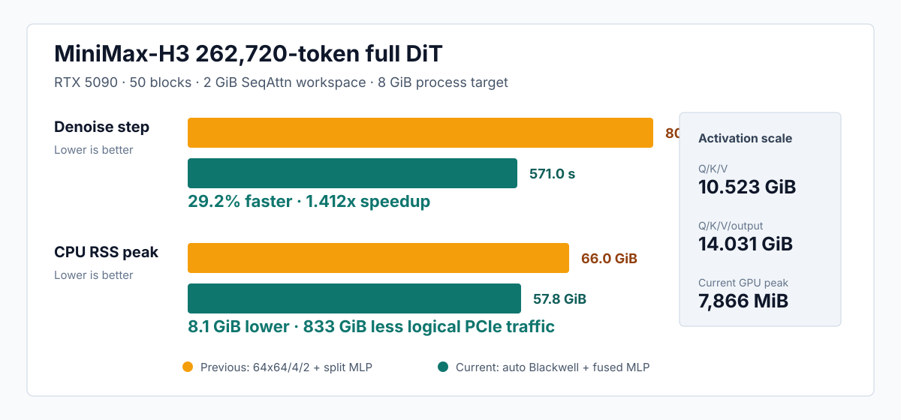
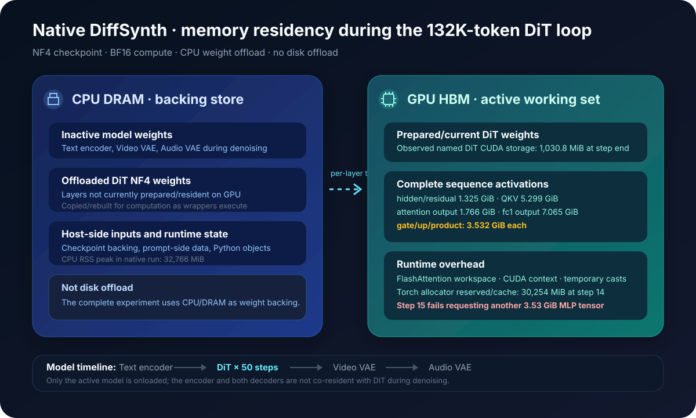

# MiniMax-H3 integration and long-video benchmark

## Executive summary

The MiniMax-H3 integration demonstrates the purpose of `seqattn` at model
scale: preserve exact dense attention semantics while moving sequence-sized
Q/K/V activations to CPU DRAM and bounding the GPU working set.

The strongest completed capacity result so far is a real H3-shaped,
262,720-token, full 50-block denoise forward under an 8GiB whole-process target:

| Metric | Measured value |
|---|---:|
| Requested video | 720×1280, 957 frames |
| Model-aligned video | 736×1280, 957 frames |
| Duration | 39.875 seconds at 24 fps |
| Packed sequence | **262,720 tokens** |
| DiT blocks | **50** |
| Denoise steps in completed probe | 1 |
| Denoise latency | **570.980 s** |
| PID-level NVML peak | **7,866 MiB** |
| Step-end process memory | 3,002 MiB |
| Torch allocated / reserved peak | 6,596 / 7,176 MiB |
| CPU RSS peak | 57,769 MiB (56.4 GiB) |
| Logical H2D | 4,756,971,125,760 bytes (4,430 GiB) |
| Logical D2H | 847,429,632,000 bytes (789 GiB) |
| Status | **success** |

Full BF16 Q/K/V is 10.523GiB and Q/K/V/output is 14.031GiB at this length, so
the attention activations alone exceed the 8GiB process target. This result
establishes one complete denoise-forward capacity and performance point. It
does not establish completion of a 50-step video.

<p align="center">
  
</p>

## What is integrated

The H3 branch connects `ProjectedAttentionRunner` to the model-owned operations
around attention:

```text
CPU hidden activation
  │
  ├─ chunk H2D
  ├─ NF4/BF16 QKV projection + Q/K norm + RoPE
  └─ pinned Q/K/V backing store
         │
         ├─ resident query super-block
         ├─ double-buffered K/V H2D
         └─ fused Triton QK + mask + online softmax + PV update
                │
                └─ GPU out projection + gate + residual
                       │
                       └─ projected hidden D2H
```

The attention output is never materialized as a complete CPU tensor and then
copied back solely for output projection.  The integration also phases the QKV
and output-projection weight leases so that these large weight groups do not
need to be resident together.

The current default MLP path acquires FC1 and FC2 together and executes
`FC1 -> SiLU/gate -> FC2 -> residual/gate` per tile on GPU. Only completed
hidden tiles return to CPU. The older split path remains available for
controlled comparisons and fallback. The implementation is inference-only and
exact; backward, dropout, and sparse attention are outside the V1 scope.

## Completed 262K optimization comparison

The current path was compared with the previous implementation sequentially on
the same physical RTX 5090 GPU3 and the same NUMA-local CPU set. Both runs used
the same 262,720-token input, checkpoint, prompt, seed, 2GiB SeqAttn workspace,
4,096-token K/V chunk, and 8,192MiB whole-process target.

| Metric | Previous `64x64/4/2` + split MLP | Current auto Blackwell + fused MLP | Change |
|---|---:|---:|---:|
| Full 50-block denoise step | 806.465 s | **570.980 s** | **29.20% faster** |
| Complete benchmark pipeline | 818.109 s | **583.017 s** | **28.74% faster** |
| CPU RSS peak | 66,048 MiB | **57,769 MiB** | **8,279 MiB lower** |
| PID-level NVML peak | **7,564 MiB** | 7,866 MiB | +302 MiB; both below 8GiB |
| Logical H2D | 4,912.582 GiB | **4,430.275 GiB** | **482.307 GiB lower** |
| Logical D2H | 1,139.999 GiB | **789.230 GiB** | **350.769 GiB lower** |

Attention H2D is unchanged at 4,033.030GiB. The 833.076GiB total logical
transfer reduction comes from eliminating the full FC1 intermediate D2H/H2D
round trip and duplicate residual H2D. Both plans require 11 resident-Q passes,
so the automatic Blackwell kernel improves update execution rather than
reducing the number of complete K/V scans.

This is an unprofiled one-run comparison. The complete protocol and raw
artifact names are in the top-level 262K optimization report.

## Native baseline memory residency

The native baseline uses DiffSynth's real CPU weight-offload path.  It is not a
comparison against a configuration that pins the entire H3 checkpoint in GPU
memory.  The benchmark configuration is:

```text
offload_device = cpu
disk offload   = disabled
activation_streaming = false
target_vram_mib = unset
DiffSynth vram_limit = physical VRAM - 2 GiB reserve
```

On the RTX 5090 this gives DiffSynth a 29.358GiB weight-preparation threshold
inside a physical 31.358GiB device.  The PyTorch allocator itself is not capped.

<p align="center">
  
</p>

### Model-level timeline

DiffSynth stages the large models rather than keeping them all on GPU:

| Pipeline phase | Model onloaded for GPU computation | Large models offloaded to CPU DRAM |
|---|---|---|
| Prompt/text preparation | Text encoder as required | DiT, Video VAE, Audio VAE |
| 50-step denoise loop | **DiT** | Text encoder, Video VAE, Audio VAE |
| Video decode | Video VAE | DiT, Text encoder, Audio VAE |
| Audio decode | Audio VAE | DiT, Text encoder, Video VAE |

Therefore the 30,876MiB native peak is not caused by the text encoder, DiT,
Video VAE, and Audio VAE all being simultaneously resident.  At the actual OOM
location the pipeline is still inside the DiT denoise loop; neither VAE decode
has started.

### Tensor-level residency during a native DiT block

| Object | Native residency | Lifetime / behavior |
|---|---|---|
| NF4 checkpoint and inactive layer weights | CPU DRAM | Backing store; no disk path |
| Prepared/current DiT layer weights | GPU HBM | Dynamically prepared or temporarily cast/rebuilt for computation |
| Video/audio latents and packed model input | GPU HBM during the forward | Updated once per scheduler step |
| Packed hidden and residual | GPU HBM | Complete 132,288-token tensors |
| Q, K, V | GPU HBM | Complete tensors produced by one full QKV projection |
| FlashAttention output | GPU HBM | Complete output before full out projection |
| MLP `fc1` output | GPU HBM | Complete `[N, 2 × 14,336]` tensor |
| MLP gate, up, SiLU/product | GPU HBM | Full sequence; product requires another 3.532GiB allocation |
| CUDA context, kernels and workspaces | GPU HBM | Non-PyTorch and temporary runtime allocations |
| PyTorch reserved allocator blocks | GPU HBM | Cached/unallocated blocks remain part of the process NVML footprint |

The benchmark's step-boundary module inspection finds 46 named CUDA
parameter/buffer storages in the DiT totaling 1,030.8MiB.  This number does not
include complete sequence activations, temporary computation-weight copies,
FlashAttention workspaces, CUDA context memory, or PyTorch cached blocks.  At
step 14 the process has 30,254MiB Torch reserved and a 30,876MiB PID-level NVML
footprint.

### Full-sequence BF16 activation scale

The following are isolated tensor sizes, not a claim that every row is live at
the exact same instruction.  Overlapping lifetimes, current layer weights,
workspace, and allocator fragmentation determine the actual peak.

| Tensor at 132,288 tokens | Shape basis | Approximate size |
|---|---:|---:|
| Hidden or residual | `N × 5,376` | 1.325 GiB |
| One of Q, K, or V | `N × 56 × 128` | 1.766 GiB |
| Combined QKV | `N × 56 × 3 × 128` | 5.299 GiB |
| Attention output before out projection | `N × 56 × 128` | 1.766 GiB |
| MLP `fc1` output | `N × 2 × 14,336` | 7.065 GiB |
| Gate or up half | `N × 14,336` | 3.532 GiB |
| `SiLU(gate) * up` result | `N × 14,336` | 3.532 GiB |

The native traceback ends at:

```python
hidden = torch.nn.functional.silu(gate) * up
```

with a failed 3.53GiB allocation request.  This directly matches the expected
BF16 size of one complete `[132,288, 14,336]` MLP intermediate.  The immediate
failure is therefore a full-sequence activation allocation, even though the
overall 30.9GiB process footprint also contains current weights, workspaces,
CUDA context memory, and allocator cache.

### Residency difference introduced by `seqattn`

`seqattn` does not change the high-level model-staging order.  It changes where
sequence-sized DiT activations live:

| Sequence-sized state | Native | `seqattn` integration |
|---|---|---|
| Hidden / residual | Full tensor in HBM | Pinned CPU tensor; projection/MLP chunks in HBM |
| Q/K/V | Full tensors in HBM | Full tensors in pinned DRAM; bounded resident-Q and K/V tiles in HBM |
| Softmax state | FlashAttention-local GPU state | FP32 online state for resident Q only |
| Attention output | Full HBM tensor | GPU tile flows directly into out projection and residual epilogue |
| MLP intermediate | Full HBM tensor | Fused tile-local FC1/gate/FC2; no full CPU FC1 intermediate |

This is why the `seqattn` process can have a higher CPU RSS while holding the
GPU step boundary near 4.43GiB and the within-step peak near 7.16GiB.

## Completed 61K controlled comparison

This comparison isolates whether making `seqattn` an independent package and
fusing the output consumer introduced an excessive integration cost.  The two
points ran serially on the same physical RTX 5090 with the same checkpoint,
input, seed, 8GiB target, 50 H3 blocks, and one denoise step.

| Metric | Prior `flash2_lse` streamed path | Independent `seqattn` | Delta |
|---|---:|---:|---:|
| Packed tokens | 61,056 | 61,056 | identical |
| Denoise latency | **67.750 s** | **71.182 s** | +5.07% |
| PID NVML peak | 5,522 MiB | **5,248 MiB** | −274 MiB |
| CPU RSS peak | 43,328 MiB | **41,845 MiB** | −1,483 MiB |
| Logical H2D | 656,996,616,192 B | **613,231,675,392 B** | −40.76 GiB |
| Logical D2H | 328,237,056,000 B | **284,472,115,200 B** | −40.76 GiB |
| Total logical PCIe | 985,233,672,192 B | **897,703,790,592 B** | **−81.52 GiB** |
| Status | success | success | — |

The independent Triton implementation is 5.07% slower than the prior local
FlashAttention-2-based streaming path at this point.  Package boundaries are
not the main cost: the remaining difference is principally kernel maturity.
In exchange, the new end-to-end consumer pipeline reduces peak device memory,
host RSS, and removes 81.5GiB of raw-attention round-trip traffic per denoise
step across the 50-block DiT.

Source JSON:

- `compare61k_seqattn_serial_q16384_480x832_f515_s1_20260818T031819Z.json`
- `compare61k_flash2_serial_q16384_480x832_f515_s1_20260818T032017Z.json`

## Projection pipeline microbenchmark

The operator-level benchmark compares the same Triton attention runtime with
and without direct output consumption.

| Tokens | Pipeline latency | Staged latency | Latency reduction | Pipeline peak | Staged peak | Peak reduction |
|---:|---:|---:|---:|---:|---:|---:|
| 3,072 | **12.35 ms** | 15.16 ms | 18.6% | **1,386 MiB** | 1,596 MiB | 210 MiB |
| 15,104 | **88.95 ms** | 102.15 ms | 12.9% | **2,718 MiB** | 3,758 MiB | 1,040 MiB |
| 61,312 | **843.44 ms** | 919.79 ms | 8.3% | **3,848 MiB** | 7,108 MiB | 3,260 MiB |

<p align="center">
  
</p>

At 61,312 tokens, direct output consumption eliminates a 1.637GiB logical raw
attention D2H→H2D round trip.  The measured peak falls by more than the raw
tensor size because the staged asynchronous path can retain several raw and
projected output allocations until their stream work completes.

## Completed dual-GPU 50-step experiment

Final status on **August 18, 2026 UTC**.

The two processes use separate physical RTX 5090 GPUs so they do not compete
for HBM or GPU compute.  They use the same image, checkpoint, prompt, seed,
requested shape, and 50-step scheduler.  CPU affinity is disjoint.  The
`seqattn` process has an 8,192MiB whole-process target; native DiffSynth has no
artificial memory limit.  GPU memory is sampled for the current PID every 2ms.

| Final result | Native DiffSynth | `seqattn` 8GiB target |
|---|---:|---:|
| Completed denoise steps | **14 / 50, then OOM** | **50 / 50** |
| Mean successful step | **140.068 s** | 238.831 s |
| Observed process peak | 30,876 MiB | **about 7,166 MiB** |
| Final step-end memory | 30,876 MiB | **about 4,434 MiB** |
| Relative peak memory | 100% | **23.2%** |
| Relative latency | 1.00× | 1.70× |

The native result is now final: status `oom`, 14 completed steps, 30,876MiB
PID-level NVML peak, and a failed 3.53GiB allocation in the full-sequence MLP
gate/up product while starting step 15.  There was no artificial native VRAM
limit.  Its reserved memory rises gradually from 30,206MiB after step 1 to
30,254MiB after step 14 while allocated memory at the sampled boundaries varies
between 1,312MiB and 4,223MiB.

At the matching 14-step checkpoint, `seqattn` remains below the strict 8GiB
target. Its step-end value stays near 4,432–4,434MiB and its within-step peak
near 7,160–7,166MiB. It then completes all 50 DiT steps in 11,941.56 seconds.
Native is faster per successful step but cannot finish the requested denoise
workload on the 32GiB card. The subsequent Video VAE assembly OOM means this is
not a completed decode or media-generation result. The newer 262K one-step
experiment is now the strongest completed activation-capacity point.

## Completed 6GiB end-to-end generation

A shorter sequence was run on physical GPU 1 to verify the complete generation
path under a stricter whole-process budget.  GPU 1 was empty immediately before
launch; the run used a dedicated Docker container and NUMA node 7.  This run
was not protected by NVIDIA `EXCLUSIVE_PROCESS`, so it is a capacity/end-to-end
result rather than the final exclusive latency comparison.

| Metric | Measured value |
|---|---:|
| Requested / output video | 480×832, 124 frames |
| Duration | 5.167 seconds at 24 fps |
| Packed sequence | 15,104 tokens |
| DiT blocks / denoise steps | 50 / 50 |
| Whole-process target | 6,144 MiB |
| PyTorch allocator limit | 5,516 MiB |
| DiffSynth weight-residency limit | 3 GiB |
| `seqattn` workspace | 1,024 MiB |
| PID-level NVML peak | **4,748 MiB** |
| Torch allocated / reserved peak | 3,771.6 / 4,058 MiB |
| CPU RSS peak | 38,697 MiB |
| Denoise total | 764.313 s |
| Mean / median step | 15.286 / 14.637 s |
| Video VAE decode | 11.836 s |
| Audio VAE decode | 0.286 s |
| Complete pipeline | 798.938 s |
| MP4 mux | 1.945 s |
| Final media | H.264 832×480 + AAC stereo 32kHz |
| Status | **success** |

The first denoise step takes 32.122 seconds while the persistent runner and
weight working set are established.  Steps 2–50 are predominantly 14.5–15.0
seconds.  Step-end PID memory remains 2,382–2,402MiB, and the largest observed
within-step peak is the first-step 4,748MiB.  There is no cross-step GPU-memory
growth.

Artifacts:

- `short6g_seqattn_480x832_f124_s50_gpu1_480x832_f124_s50_20260818T070725Z.json`
- `short6g_seqattn_480x832_f124_s50_gpu1_480x832_f124_s50_20260818T070725Z_memory_trace.csv.gz`
- `short6g_seqattn_480x832_f124_s50_gpu1_480x832_f124_s50_20260818T070725Z_latents.pt`
- `short6g_seqattn_480x832_f124_s50_gpu1_480x832_f124_s50_20260818T070725Z.mp4`

The media was independently opened with PyAV.  It contains 124 H.264 frames,
an 832×480 video stream lasting 5.1667 seconds, and a two-channel AAC stream at
32kHz lasting 5.175 seconds.

This completed point narrows the remaining 132K issue: sequence-streamed DiT
can finish all 50 steps under 8GiB, while the very large Video VAE tile-row
assembly still needs a CPU-backed concatenation path.  The shorter 15K output
fits the same decoder implementation under 6GiB and completes normally.

Native result JSON:

- `final_720p20s_native_unlimited_gpu1_720x1280_f480_s50_20260818T033056Z.json`

## Measurement protocol

- Model: MiniMax-H3 FL2VA NF4.
- Compute dtype: BF16.
- Weight backing: CPU DRAM offload; no disk offload.
- GPU: NVIDIA GeForce RTX 5090, CUDA 12.8, PyTorch 2.10.0+cu128.
- `seqattn` workspace: 2,048MiB; K/V tile: 4,096 tokens.
- Whole-process target: 8,192MiB.
- PyTorch allocator limit: target minus measured CUDA-context memory and a
  128MiB safety margin.
- Memory source of record: PID-level NVML sampling, not Torch peak alone.
- Sampling interval: 100ms for the 262K optimization comparison, 2ms for the
  132K experiments, and 5ms for the 61K serial comparison.
- Logical H2D/D2H bytes are instrumented operator traffic and should not be
  interpreted as measured PCIe-link throughput.
- Each completed comparison point is a single measured run; no error bars or
  statistical-significance claim is made.

## Interpretation and limits

The data supports a narrow, useful claim:

> `seqattn` substantially lowers the GPU capacity required for exact dense H3
> attention, allowing a 262K-token workload with 10.523GiB of BF16 Q/K/V to
> execute below an 8GiB whole-process target. At 132K tokens, native
> full-sequence execution already consumes nearly the entire 32GiB RTX 5090.

It does not support a claim that `seqattn` is faster than native FlashAttention
when the full sequence fits.  Current costs include repeated K/V transfer for
each resident-Q super-block, larger CPU activation storage, and a Triton kernel
that is less mature than FlashAttention 2.  The main optimization opportunities
are larger safe resident-Q sets, overlapped projection/transfer/compute, more
aggressive output epilogues, and tensor-core-oriented kernel specialization.
