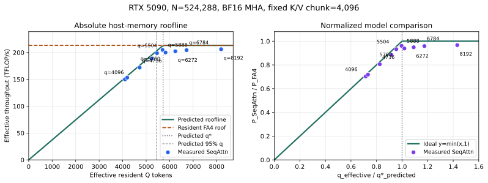
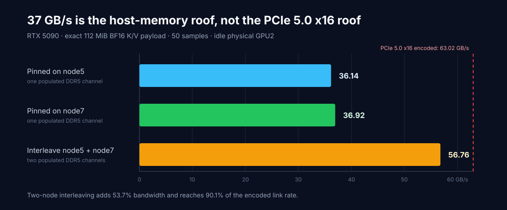
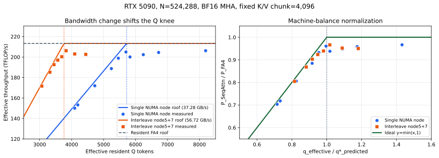

# RTX 5090 Host-Memory Roofline Experiment 0

Date: 2026-08-24

Status: in progress. Independent calibration, balanced sampling around both
predicted Q knees, and clean reruns of the previously contaminated points are
complete. The remaining coarse sweep, independent process replications, and
profiler captures are still pending.

## Question

For exact non-causal BF16 MHA with a fixed 4,096-token K/V chunk, does SeqAttn
throughput follow the independently calibrated host-memory roofline

```text
P(q) = min(B_P * q_effective, P_FA4)?
```

The workspace is held at 4GiB and only resident Q is varied. The prediction was
committed before any new Q-sweep result was launched.

<p align="center">
  
</p>

## Locked Shape

```text
GPU:             NVIDIA GeForce RTX 5090, physical GPU3
tokens:          524,288
Q/K/V heads:     56 / 56 / 56
head dimension:  128
dtype:           BF16
causal:          false
KV chunk:        4,096
kernel:          BLOCK_M=128, BLOCK_N=64, warps=8, stages=3
KV buffers:      2
output:          pinned host DRAM
```

Input tensors are generated deterministically in pinned DRAM with 32 CPU
workers and 4,096-token chunks. Data preparation is outside attention timing.

## Independent Inputs

The two model inputs have different sources and must not be conflated.

| Input | Measurement | Frozen value |
|---|---|---:|
| `B_P` | Median concurrent H2D service rate while the SeqAttn update kernel is active; equal-weight median of `q_compute=8192` and `16384` | 37.2840 GB/s |
| `P_FA4` | Median of 10 CUDA-event FA4 throughput samples at the complete 524K resident shape, after 5 warmups | 213.3230 TFLOP/s |

The resulting prospective prediction is:

```text
q_star_predicted = 5,721.56
q_95_predicted   = 5,435.49
q_star_aligned   = 5,760
workspace(q=5760, k=4096) = 573.4609375 MiB
```

The pre-registration is
[`prediction.json`](experiments/rtx5090_host_memory_roofline_experiment0_20260824/prediction.json).

## Single-Node Observations

The initial points use one warmup and five measured executions. The 2026-08-24
balanced rerun uses one warmup and three measured executions in a fresh process
per Q value. The primary throughput uses a CUDA-event interval ending after the
last finalize on the compute stream, so it excludes only the final D2H tail.
The full host-output wall interval is retained separately.

| Requested q | Effective q | Q passes | Predicted TFLOPS | Measured pipeline TFLOPS | Measured / predicted | Measured / FA4 |
|---:|---:|---:|---:|---:|---:|---:|
| 4,096 | 4,096.0 | 128 | 152.72 | 150.02 | 98.24% | 70.33% |
| 4,224 | 4,194.3 | 125 | 156.38 | 153.25 | 98.00% | 71.84% |
| 4,736 | 4,723.3 | 111 | 176.10 | 171.95 | 97.64% | 80.61% |
| 5,248 | 5,242.9 | 100 | 195.48 | 188.72 | 96.55% | 88.47% |
| 5,504 | 5,461.3 | 96 | 203.62 | 198.86 | 97.66% | 93.22% |
| 5,760 | 5,698.8 | 92 | 212.47 | 204.93 | 96.45% | 96.07% |
| 5,888 | 5,825.4 | 90 | 213.32 | 200.10 | 93.80% | 93.80% |
| 6,272 | 6,241.5 | 84 | 213.32 | 202.35 | 94.85% | 94.85% |
| 6,784 | 6,721.6 | 78 | 213.32 | 204.48 | 95.85% | 95.85% |
| 8,192 | 8,192.0 | 64 | 213.32 | 206.21 | 96.66% | 96.66% |

The six points on the predicted bandwidth branch are within 1.76% to 3.55% of
the prospective model. In particular:

1. At `q=4096`, the model predicts the PCIe branch rather than the compute
   roof. Measured throughput is 98.24% of that prediction.
2. At `q=5504`, the exact finite-N effective Q is 5,461.3 tokens. Measured
   throughput is 97.66% of the predicted PCIe roof at that point.
3. At the aligned intersection `q=5760`, SeqAttn reaches 96.07% of the
   independently measured resident FA4 roof.
4. The clean `q=4736` rerun reaches 97.64% of its prediction, replacing the
   contaminated 159.87TFLOP/s observation.
5. The three new points above the predicted intersection rise from 200.10 to
   204.48TFLOP/s before reaching 206.21TFLOP/s at `q=8192`.

Using `q=5888`, `6272`, `6784`, and `8192`, the single-node plateau median is
203.411TFLOP/s, or 95.35% of `P_FA4`. This is not a
failure of the host-link intensity model: FA4 and SeqAttn are different
kernels. It measures the cross-kernel efficiency factor that the experiment
was designed to expose:

```text
eta_single = P_SeqAttn,plateau / P_FA4 = 0.9535
95% plateau threshold                         = 193.240 TFLOP/s
first measured effective q above threshold    = 5,461.333 (requested q=5,504)
corrected intersection                        = 5,748.772 tokens
prediction error versus q*=5,721.564          = +0.48%
```

The full sweep is needed before freezing `eta` or the observed 5% knee.

## Timing Boundary

Pipeline and full wall throughput differ by less than 0.02% at these long
sequence points. The final 7GiB output transfer is almost entirely overlapped
with preceding Q chunks; only its final tail lies outside the compute-stream
completion event. CUDA-event and host wall timers are different clock domains,
so sub-millisecond signed differences must not be interpreted as standalone
copy latency.

## Why H2D Is 37GB/s Instead of 60GB/s

The PCIe endpoint and root port both negotiate PCIe 5.0 x16. After 128b/130b
encoding, the link carries at most 63.015GB/s before transaction-layer and
implementation overhead, so protocol overhead alone cannot explain a stable
37.3GB/s result.

The host-memory topology does explain it. This two-socket EPYC 9754 system has
256GiB total DRAM. Linux EDAC reports memory only on channel indices 3 and 9 of
each socket, with 64GiB on each populated channel. With NPS4 enabled, only NUMA
nodes 1, 3, 5, and 7 have memory; nodes 0, 2, 4, and 6 have zero local memory.
GPU3 is attached to node5, so the locked NUMA-local allocation is supplied by
one populated DDR5 channel.

<p align="center">
  
</p>

The causal check used idle physical GPU2 and the exact runtime payload: two
back-to-back 56MiB BF16 copies, 10 warmups, and 50 measured samples.

| Pinned-memory policy | Median GB/s | p10 GB/s | p90 GB/s | Interpretation |
|---|---:|---:|---:|---|
| `membind=5` | 36.145 | 35.432 | 36.595 | one populated channel |
| `membind=7` | 36.923 | 36.399 | 37.236 | one populated channel |
| `interleave=5,7` | 56.760 | 56.756 | 56.764 | two populated channels |

Interleaving the same pinned allocation across the socket's two populated
memory nodes raises H2D bandwidth by 53.7% and reaches 90.1% of the encoded
PCIe 5.0 x16 line rate. This rules out an intrinsic 37GB/s RTX 5090 copy-engine
ceiling. The original 37.284GB/s calibration is a valid measured input for the
locked single-node experiment, but its correct name is the current machine's
effective host-supply roof, not the theoretical PCIe roof.

This distinction matters for portability. Fully populating more memory
channels, or deliberately interleaving pinned pages across channels, increases
`B_P`, moves the predicted knee to smaller resident Q, and changes the hardware
profile without changing the SeqAttn kernel.

One GPU3 recheck performed after an unrelated training process started at
2026-08-24 06:28:45 UTC fell to 27.50GB/s and was rejected as contaminated.
The original `q=4736` run also completed after that start time. A clean rerun on
the integrated commit measured 171.95TFLOP/s with per-repeat pipeline times of
45.822, 45.808, and 45.871 seconds; only this rerun enters the formal summary.
The earlier `q=6272` and `q=7296` values were also treated as suspect because
they fell to about 191TFLOP/s while adjacent plateau points remained near
205TFLOP/s. The clean `q=6272` rerun reached 202.35TFLOP/s; `q=7296` remains
excluded because it was not required by the balanced sampling plan.

## Preliminary Bandwidth-Shift Validation

Experiment 0B changes only pinned-memory placement from `membind=5` to
`interleave=5,7`. The shape, GPU, K/V chunk, kernel profile, buffer counts,
workspace guardrail, output mode, and FA4 roof remain fixed.

The GPU3 calibration was completed before the new q-sweep:

| Measurement | Median GB/s |
|---|---:|
| Single-node concurrent `B_P` | 37.2840 |
| Interleaved bare H2D | 56.7552 |
| Interleaved concurrent, `q_compute=8192` | 56.7196 |
| Interleaved concurrent, `q_compute=16384` | 56.7144 |
| Frozen interleaved `B_P` | **56.7170** |

This bandwidth increase changes the prospective prediction from:

```text
single node: q_star=5721.56, q_95=5435.49
interleaved: q_star=3761.18, q_95=3573.12
```

The predicted full-roof intersection moves left by 34.3%. The prediction was
committed before any interleaved q result at
`docs/experiments/rtx5090_host_memory_roofline_experiment0b_interleave57_20260824/prediction.json`.

<p align="center">
  
</p>

The complete uncontended quick sweep uses one warmup and three measured
repeats in one independent process per Q value. Every resumed process used
explicit `numactl --interleave=5,7`, 32 input-generation workers, parallel
pinned Q/K/V allocation, and output-buffer allocation overlapped with input
preparation.

| Policy | Requested q | Effective q | Predicted TFLOPS | Pipeline TFLOPS | Observed / predicted |
|---|---:|---:|---:|---:|---:|
| Single node | 4,096 | 4,096.0 | 152.72 | 150.02 | 98.24% |
| Interleaved | 3,072 | 3,066.0 | 173.90 | 171.64 | 98.70% |
| Interleaved | 3,328 | 3,318.3 | 188.20 | 185.28 | 98.45% |
| Interleaved | 3,456 | 3,449.3 | 195.63 | 192.59 | 98.44% |
| Interleaved | 3,584 | 3,566.6 | 202.29 | 196.98 | 97.38% |
| Interleaved | 3,712 | 3,692.2 | 209.41 | 200.32 | 95.66% |
| Interleaved | 3,840 | 3,826.9 | 213.32 | 206.19 | 96.66% |
| Interleaved | 4,096 | 4,096.0 | 213.32 | 203.07 | 95.19% |
| Interleaved | 4,480 | 4,443.1 | 213.32 | 202.64 | 94.99% |

At identical `q=4096`, the measured throughput rises from 150.02 to
203.07TFLOP/s, a 35.4% gain caused only by the host-memory placement change.
All eight interleaved points reach 94.99% to 98.70% of the prospective model.
The three points below 3.5K effective Q remain within 1.56% of the predicted
host-bandwidth branch.

For the balanced rerun, define the high-Q plateau as the median of `q=3840`,
`4096`, and `4480`:

```text
balanced plateau:              203.072 TFLOP/s
eta versus resident FA4:       0.95195
95% plateau threshold:         192.919 TFLOP/s
first effective q above 95%:   3566.585 tokens (requested q=3584)
corrected intersection:        3566.585 / 0.95 = 3754.300 tokens
prediction error versus q*:    -0.183%
```

This is the predeclared directional acceptance signal: the transition moved
from approximately 5.3K-5.5K effective Q under single-node placement to about
3.6K-3.8K after the measured bandwidth increase. It is not the publication
estimate because each point still has only one independent process.

One old `q=3840` process produced per-repeat pipeline times of 38.33, 62.83, and
73.90 seconds. The progressive slowdown coincided with unrelated host jobs
consuming tens of GiB and reducing node7 free memory. Those runs remain in the
raw artifact directory but are excluded. The clean integrated-branch rerun
measured 38.199, 38.223, and 38.248 seconds, corresponding to 206.19TFLOP/s.
GPU `Exclusive_Process` prevents CUDA-context contention but does not isolate
host DRAM capacity or bandwidth.

The parallel allocation path was validated before resuming the formal points.
A 448MiB four-tensor pinned-allocation smoke completed in 1.305 seconds, and a
16K-token streaming smoke completed successfully with 1.284 seconds of data
preparation. Full 524K preparation for the four resumed points took 26.7 to
64.7 seconds; none repeated the earlier five-minute single-threaded stall.

One resumed launcher was accidentally started without the explicit
`numactl --interleave=5,7` prefix. NUMA counters showed its allocation landing
almost entirely on node5, so it was interrupted before producing a result
JSON. Its incomplete manifest is retained under `q_sweep_quick_resume/` and is
excluded. The valid rerun is under `q_sweep_quick_resume_interleave57/`.

## Balanced Knee Sampling

The 2026-08-24 rerun samples the two policies at approximately matching
normalized positions to the right of their distinct predicted knees. Every row
uses one warmup and three measured executions in one fresh process.

| Policy | q* | Requested q | Effective q / q* | Pipeline TFLOPS |
|---|---:|---:|---:|---:|
| `membind=5` | 5,721.56 | 5,888 | 1.018 | 200.10 |
| `interleave=5,7` | 3,761.18 | 3,840 | 1.017 | 206.19 |
| `membind=5` | 5,721.56 | 6,272 | 1.091 | 202.35 |
| `interleave=5,7` | 3,761.18 | 4,096 | 1.089 | 203.07 |
| `membind=5` | 5,721.56 | 6,784 | 1.175 | 204.48 |
| `interleave=5,7` | 3,761.18 | 4,480 | 1.181 | 202.64 |

The concurrent H2D rechecks immediately before the reruns measured
37.23-37.30GB/s for `membind=5` and 56.71-56.72GB/s for
`interleave=5,7`, consistent with both frozen predictions. The paired samples
therefore compare two stable host-supply roofs rather than two different
contention states.

## Current Conclusion

The prospective model now has balanced observations on both sides of both
predicted knees. The bandwidth branches remain within 1.3-4.4% of prediction,
and the threshold-corrected intersections differ from the independently
predicted q* values by +0.48% for `membind=5` and -0.18% for
`interleave=5,7`. The host-memory placement change moves the measured
transition in the predicted direction without changing the attention kernel.

This is still an interim result. Publication claims require:

- completion of the preregistered fine and coarse Q sets;
- three independent processes per Q;
- an observed-knee definition based on the measured high-Q plateau;
- Nsight Systems traces below, near, and above the knee;
- the final fixed-4K workspace validation.

## Artifacts

```text
Calibration:
workspace/benchmarks/results/rtx5090_host_memory_roofline_experiment0_20260824/calibration/

Sentinel Q results:
workspace/benchmarks/results/rtx5090_host_memory_roofline_experiment0_20260824/q_sweep_k4096_sentinel/

Fine sweep, round 1:
workspace/benchmarks/results/rtx5090_host_memory_roofline_experiment0_20260824/q_sweep_k4096_fine_round1/

Machine-readable report data:
docs/experiments/rtx5090_host_memory_roofline_experiment0_20260824/observations.json

PCIe/memory-population diagnostic summary:
docs/experiments/rtx5090_host_memory_roofline_experiment0_20260824/pcie_memory_population_diagnostic.json

Bandwidth-shift comparison summary:
docs/experiments/rtx5090_host_memory_roofline_experiment0b_interleave57_20260824/comparison_observations.json

Raw PCIe/memory-population runs:
workspace/benchmarks/results/rtx5090_pcie_memory_population_20260824/

Raw interleaved calibration and q results:
workspace/benchmarks/results/rtx5090_host_memory_roofline_experiment0b_interleave57_20260824/

Clean resumed interleaved Q results:
workspace/benchmarks/results/rtx5090_host_memory_roofline_experiment0b_interleave57_20260824/q_sweep_quick_resume_interleave57/
workspace/benchmarks/results/rtx5090_host_memory_roofline_experiment0b_interleave57_20260824/q_sweep_quick_missing_interleave57/

Balanced single-node/interleaved rerun and calibration:
workspace/benchmarks/results/rtx5090_host_memory_roofline_balanced_rerun_20260824/
```

The original plot and observation summary are regenerated with
`benchmarks/analyze_host_memory_roofline.py`. The bandwidth-shift comparison is
regenerated with `benchmarks/analyze_host_memory_roofline_comparison.py`.
